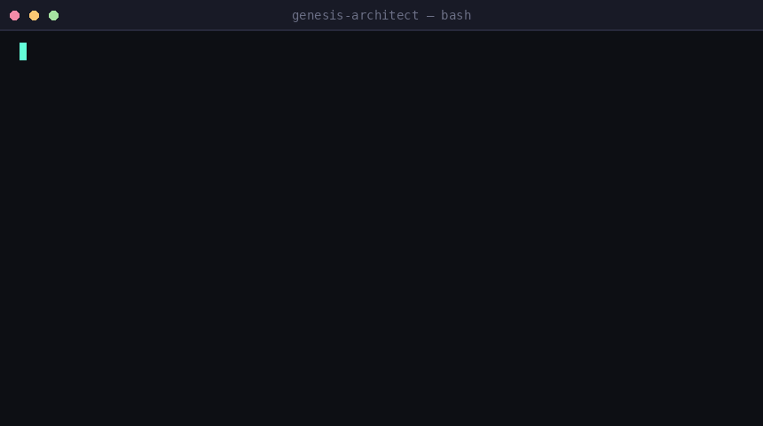
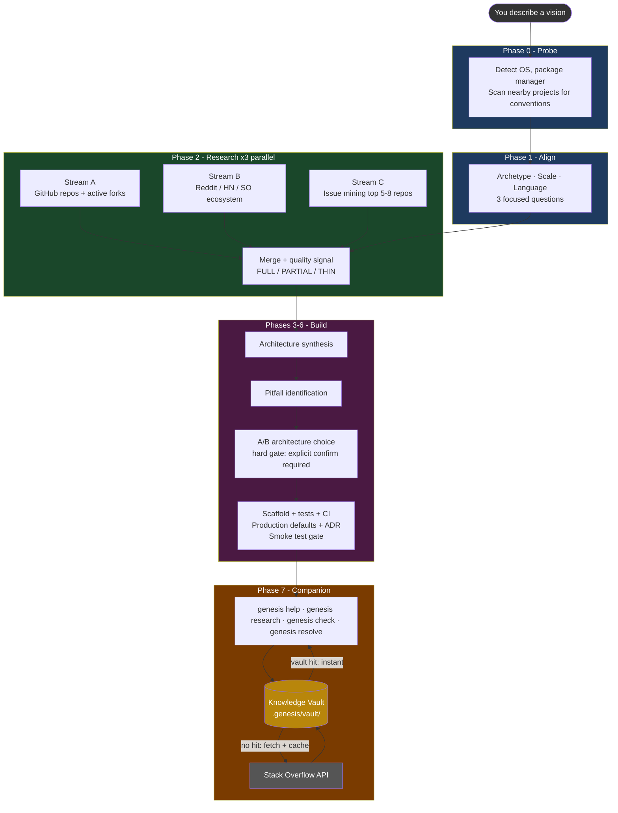

<div align="center">

# Genesis Architect

**The AI Software Architect that stays with you for the entire project lifecycle.**
Not a one-time scaffolder. A research-first architect that mines real production failures,
builds your project to avoid them, and keeps learning alongside you as you ship.

[](https://github.com/maioio/genesis-architect/actions)
[](CHANGELOG.md)
[](LICENSE)
[](https://github.com/anthropics/claude-code)
[](https://snyk.io/test/github/maioio/genesis-architect)

[](https://sonarcloud.io/summary/new_code?id=maioio_genesis-architect)
[](https://sonarcloud.io/summary/new_code?id=maioio_genesis-architect)
[](https://sonarcloud.io/summary/new_code?id=maioio_genesis-architect)
[](https://sonarcloud.io/summary/new_code?id=maioio_genesis-architect)

[](SKILL.md)
[](references/architecture-patterns.md)
[](SKILL.md)
[](tests/)
[](evals/test_queries.json)
[](https://github.com/maioio/genesis-architect/stargazers)

[](https://github.com/sponsors/maioio)
[](https://buymeacoffee.com/maioio)

<br/>

> Scans 15-20 real GitHub repos, mines their Issues for what broke in production,
> builds your project to avoid those mistakes - then stays active as your architect
> **for the entire development lifecycle.**

<br/>



**If this saved you from a bad architecture decision - [star it](https://github.com/maioio/genesis-architect/stargazers). It helps others find it.**

</div>

---

## What's new in v2.3.0

> [!NOTE]
> v2.3.0 adds 93 total unit tests, overhauls CI for reliability, and wires SonarCloud coverage. v2.2.0 closed 5 community-requested issues with new scripts and hardened internals.

| Feature | What it does |
|---------|-------------|
| **93 unit tests** | Full coverage of scaffold_generator, pitfall_coverage_check, genesis_subcommands |
| **CI overhaul** | Gitleaks pinned, optional jobs skip when secrets missing, ~40% faster per push |
| **Hard gate state files** | `genesis_state.py` - Phase 5/6 gates are now machine-readable, not prose wishes |
| **`genesis check` command** | Queries OSV.dev for CVEs in your deps, audits CI action versions - JSON output |
| **Mitigation coverage check** | `pitfall_coverage_check.py` - verifies each PITFALLS.md mitigation exists in source |
| **Single source of truth** | `references/folder-structures.toml` - all scaffold file lists in one place |
| **Eval schema validation** | `eval_runner --mode validate` wired into CI - catches eval drift before it ships |

---

## Why Genesis Architect is different

Every other tool - `create-t3-app`, `bolt.new`, Copilot Workspace, Cookiecutter - generates code from templates. They have no idea what broke in production for the 50,000 developers who built the same thing before you. And they stop helping the moment the scaffold is created.

Genesis Architect treats every project as a **research problem first**, and treats development as a **continuous collaboration** - not a one-time event.

```
Day 1: You describe a vision
       Genesis researches 15-20 real repos and their Issues
       Builds a scaffold that avoids the mistakes it found
       Three security gates activate on the first commit

Day 30: You hit a bug
        genesis resolve "path traversal python"
        Vault hit: instant answer from last project, no API call

Day 60: Deps are aging
        genesis check
        CVE scan + CI action version audit, upgrade commands ready

Day 90: New feature needs research
        genesis research "rate limiting patterns"
        Searches Phase 2 repos first, then ecosystem - cites sources
```

---

## How it works: three stages

### Stage 1: Deep Research

Before writing a single file, Genesis Architect runs three parallel research streams:

- **Stream A**: Scans 15-20 GitHub repos matching your vision. Filters by stars, recency, and language.
- **Stream B**: Searches Reddit, Hacker News, and Stack Overflow for architecture regrets and pitfalls in the wild.
- **Stream C**: For the top 5-8 repos, mines up to 100 GitHub Issues each. Ranks by engagement (comments + reactions). Extracts recurring failures, security patches, and architecture regrets.

Active forks of researched repos are also scanned for bug fixes not yet merged upstream. The result is a `RESEARCH.md` with verified citations and a `PITFALLS.md` with real root causes and mitigations built into the scaffold.

### Stage 2: Secure Scaffolding

The scaffold is generated with hard gates that cannot be skipped:

- Phase 5 requires an explicit A/B/C/D architecture choice - "looks good" is not accepted
- Phase 6 blocks `git commit` until the smoke test exits 0
- Every scaffold includes `utils/security.py` or `src/utils/security.ts` with `get_safe_path` for projects handling user-supplied file paths
- Four parallel CI jobs activate on the first push: secret scanning, SAST, quality gate, and internal constraints check

### Stage 3: Smart Resolution (the feedback loop)

After scaffolding, the Knowledge Vault starts building up:

```
You hit a problem
       ↓
genesis resolve "csv streaming large file python"
       ↓
Check local .genesis/vault/ first
       ↓
Vault hit? Return instantly. No API call. No tokens.
       ↓
No hit? Query Stack Overflow API for top 3 accepted answers
       ↓
Display with source link. You confirm before anything changes.
       ↓
Solution saved to vault for next time.
```

The vault grows with every project. A solution found for a path traversal issue in one project is immediately available in the next one.

---

## Visual architecture



> [!NOTE]
> **Three hard gates protect you:** Phase 2 stops if fewer than 5 repos found. Phase 5 requires an explicit A/B/C/D choice. Phase 6 blocks `git commit` until the smoke test passes.

---

## Install

```bash
# Claude Code (recommended)
git clone https://github.com/maioio/genesis-architect ~/.claude/skills/genesis-architect

# Cursor
# Copy SKILL.md to .cursor/rules/genesis-architect.md

# Codex CLI
git clone https://github.com/maioio/genesis-architect ~/.codex/skills/genesis-architect
```

No build step, no dependencies.

---

## Usage

<details>
<summary><b>Explicit commands</b></summary>

```
genesis init a REST API in TypeScript
genesis init a Python CLI for batch image processing
genesis init a Chrome extension that does X
genesis init --from-prd PRD.md          # read a product spec, skip Phase 1
genesis init --from-team-config          # restore a teammate's research
genesis audit ./my-existing-project      # audit existing code, no scaffold
genesis harden ./my-existing-project     # inject security gates into any project
genesis resolve path traversal python    # Smart Resolution Engine
```

</details>

<details>
<summary><b>Natural triggers - just describe what you want</b></summary>

```
I want to build a Telegram bot
scaffold a new project for web scraping
start building a VS Code extension
I need to build a data pipeline from scratch
create a tool that converts CSV to JSON
```

</details>

---

## What every project gets

| Deliverable | Contents |
|-------------|----------|
| `RESEARCH.md` | 15-20 repos scanned, top 5-8 deeply analyzed, sources linked, ecosystem velocity signals |
| `PITFALLS.md` | 3-7 real pitfalls from GitHub Issues with root causes and mitigations |
| `ROADMAP.md` | 5-10 phase development plan including "Activate Quality Gates" phase |
| `src/` | Functional boilerplate - not empty stubs |
| `tests/` | Passing unit tests for core logic |
| `.github/workflows/ci.yml` | 4 parallel jobs: tests, secret scanning, SAST, code quality gate |
| `utils/security.py` or `security.ts` | `get_safe_path` guard for all file I/O (when applicable) |
| `docs/adr/001-initial-architecture.md` | Every architectural decision explained with evidence |
| `.gitignore` | Language-appropriate, hardened against secrets and build artifacts |
| `sonar-project.properties` | Code quality gate config, ready to activate with one secret |
| `.pre-commit-config.yaml` | Local pre-commit hook - blocks secrets before they reach GitHub |

**Production-readiness defaults baked into every scaffold:**

| Default | What it does |
|---------|-------------|
| Structured logging | `pino`/`winston`/`slog` from line 1 - no `console.log` in production |
| Non-root Dockerfile | `USER 1001` - never runs as root |
| Env validation | Fails loudly at startup if required vars are missing |
| `GET /health` | Returns `{"status":"ok"}` (Web Service archetype) |
| No wildcard CORS | Explicitly listed origins only |
| Secret Zero | `.env.example` with generation hint, validated at startup |
| Secret scanning CI | Every push scanned - build fails on exposed credentials |
| SAST analysis CI | Static analysis catches injection and path traversal on every push |
| Code quality gate | Merge blocked on maintainability or security regressions |

---

## Development Companion Mode

After scaffolding, Genesis Architect stays active for the rest of your session - and picks up where it left off in future sessions by reading `RESEARCH.md` from your project directory.

```
genesis help I need to add rate limiting      → searches Phase 2 repos for how they solved it
genesis research authentication patterns      → targeted scan with 1-3 ranked approaches
genesis check                                 → freshness audit: CVEs, outdated deps, CI versions
genesis harden ./existing-project             → inject security gates into any existing project
genesis resolve path traversal python         → Smart Resolution Engine with vault-first lookup
```

---

## Smart Resolution Engine

`genesis resolve [topic]` is a two-layer system designed to get you an answer as fast as possible while building up institutional knowledge over time.

**Layer 1 - Knowledge Vault (instant, free):**
Every problem you resolve is stored in `.genesis/vault/` tagged by topic and language. On the next query, the vault is checked first. If there is a match, the answer comes back instantly - no network call, no tokens consumed.

```bash
# Search the vault directly
python scripts/vault.py search "path traversal" python

# Save a solution to the vault
python scripts/vault.py save "path traversal" python "Use get_safe_path..." --source https://...

# See vault stats
python scripts/vault.py stats
```

**Layer 2 - Stack Overflow API (when vault misses):**
Fetches the top 3 community-verified solutions. Prioritizes accepted answers and high-score results. Classifies each as "recent" (last 24 months) or "classic". Caches the result in the vault for next time.

```
$ genesis resolve "csv streaming large file python"

Smart Resolution Engine
Query: 'csv streaming large file python'
Source: Stack Overflow community answers

============================================================
Result 1: Streaming CSV from S3 to Python
  Score: 16  |  Answers: 5  |  Tags: python, boto3
  [TOP ANSWER: score 11]  [type: classic]

  Use chunked reading: read a block, find the last newline, process.
  chunk_size = 1_000_000 ...

  Source: https://stackoverflow.com/a/51142062
============================================================

IMPORTANT: Always review community solutions before applying.
Genesis Architect never patches your code without your confirmation.
```

No API key required (300 requests/day). Set `STACKOVERFLOW_KEY` env var for 10,000/day.

---

## Languages and archetypes

**Languages** auto-detected from research:

```
TypeScript / JavaScript    Python    Go    Rust
```

**Archetypes** - each shapes the entire scaffold differently:

| Archetype | Entrypoint | Has server | Has Dockerfile | Test runner |
|-----------|-----------|-----------|----------------|-------------|
| CLI Tool | `bin` / `[project.scripts]` | No | Optional | pytest / jest |
| Library/SDK | Public API, no `main()` | No | No | pytest / jest |
| Web Service/API | Router | Yes | Yes + `/health` | pytest / jest |
| Frontend App | Component tree | No (SSR optional) | Optional | vitest / jest |

---

## How Genesis Architect compares

| Capability | Genesis Architect | create-t3-app | bolt.new | Cursor Rules | madison/scaffolding |
|-----------|:-----------------:|:-------------:|:--------:|:------------:|:-------------------:|
| Research from real GitHub Issues | Yes | No | No | No | No |
| Validates citations (no hallucinated repos) | Yes | n/a | No | n/a | No |
| Anti-hallucination CVE check (OSV.dev) | Yes | No | No | No | No |
| Research Quality Signal (FULL/PARTIAL/THIN) | Yes | No | No | No | No |
| Hard gates before file creation | Yes | No | No | No | Yes |
| Secret scanning + SAST on every scaffold | Yes | No | No | No | No |
| Retrofit security into existing projects | Yes | No | No | No | No |
| Smart Resolution Engine with local vault | Yes | No | No | No | No |
| Active fork intelligence | Yes | No | No | No | No |
| Works without any MCP | Yes | n/a | n/a | n/a | n/a |
| PRD-driven flow (`--from-prd`) | Yes | No | No | No | No |
| Stays active for entire project lifecycle | Yes | No | No | No | No |

> Assessments based on public documentation as of 2026. Some capabilities may vary by version or configuration.

---

## Works at every level of MCP setup

| Setup | Research quality | Speed |
|-------|-----------------|-------|
| No MCPs | Web search - real repos, shallower issue data | Normal |
| GitHub MCP | Deep repo scan + real Issue extraction | Normal |
| GitHub + Exa | Full parallel: repos + Reddit/HN/SO context | ~3x faster |
| GitHub + Exa + Firecrawl | Full parallel + targeted page scraping | ~3x faster |

> [!TIP]
> The skill never blocks on a missing tool. It reports what it's using and continues.

---

## Real output - not fabricated

From actual projects:

**TypeScript CLI:**
- [`examples/typescript-cli/RESEARCH.md`](examples/typescript-cli/RESEARCH.md) - 5 repos analyzed, every source linked and verified
- [`examples/typescript-cli/PITFALLS.md`](examples/typescript-cli/PITFALLS.md) - 4 real pitfalls from live GitHub Issues
- [`examples/typescript-cli/ROADMAP.md`](examples/typescript-cli/ROADMAP.md) - 5-phase plan calibrated to research findings

**Python CLI:**
- [`examples/python-cli/RESEARCH.md`](examples/python-cli/RESEARCH.md) - click, typer, python-fire, tqdm, prompt-toolkit analyzed
- [`examples/python-cli/PITFALLS.md`](examples/python-cli/PITFALLS.md) - 4 pitfalls: click#2416, click#2558, tqdm#1139, typer#522 - all verified
- [`examples/python-cli/src/`](examples/python-cli/src/) - working Python CLI with Click, get_safe_path, and full test suite

---

## What contributors found

> First external contributor [@nitayk](https://github.com/nitayk) opened 7 issues and submitted a 444-line PR with a self-contained code review - finding and fixing 4 bugs - within 48 hours of launch.

---

## Project structure

<details>
<summary><b>Full layout</b></summary>

```
genesis-architect/
├── SKILL.md                        # Skill definition - the brain
├── plugin.json                     # Marketplace manifest
├── scripts/
│   ├── scaffold_generator.py       # Creates project structure (loads from folder-structures.toml)
│   ├── research_validator.py       # Validates RESEARCH.md + live GitHub URL checks
│   ├── resolve_engine.py           # Smart Resolution Engine (Stack Overflow API + vault)
│   ├── vault.py                    # Knowledge Vault - local solution cache
│   ├── genesis_state.py            # Phase 5/6 hard gate state files
│   ├── genesis_subcommands.py      # genesis check: CVE scan + CI action audit
│   ├── pitfall_coverage_check.py   # Verifies PITFALLS.md mitigations exist in source
│   ├── drift_detector.py           # Architecture drift detection vs ADR baseline
│   ├── issue_miner.py              # GitHub Issue mining (GraphQL + REST)
│   ├── feedback.py                 # Pitfall feedback recorder
│   ├── env_probe.py                # Phase 0 environment detection
│   └── eval_runner.py              # Trigger rate eval + schema validation
├── tests/                          # 93 unit tests
│   ├── test_scaffold_generator.py  # 41 tests - all combos, path traversal, TOML integrity
│   ├── test_pr13_scripts.py        # 52 tests - pitfall_coverage_check + genesis_subcommands
│   ├── test_research_validator.py  # 12 tests for validator logic
│   └── test_resolve_engine.py      # 9 tests for resolution engine
├── evals/
│   ├── test_queries.json           # 40 trigger/no-trigger test cases (100% accuracy)
│   └── README.md
├── examples/
│   ├── typescript-cli/             # Real TypeScript CLI output
│   │   ├── RESEARCH.md
│   │   ├── PITFALLS.md
│   │   └── ROADMAP.md
│   └── python-cli/                 # Real Python CLI output
│       ├── RESEARCH.md
│       ├── PITFALLS.md
│       └── ROADMAP.md
├── assets/
│   ├── demo.gif                    # Demo recording (see DEMO_SCRIPT.md to record)
│   ├── RESEARCH.template.md
│   ├── PITFALLS.template.md
│   └── ROADMAP.template.md
├── references/
│   ├── architecture-patterns.md    # Boilerplate per language/tier + production defaults
│   ├── mcp-strategy.md             # MCP tool strategy and fallback logic
│   └── security-templates.md       # CI templates for secret scanning, SAST, quality gate
├── .github/
│   ├── dependabot.yml              # Weekly automated dependency updates
│   └── workflows/
│       ├── ci.yml                  # Tests, secret scanning, SAST, quality gate
│       └── codeql.yml              # GitHub Code Scanning
├── pyproject.toml                  # pytest + ruff config
├── DEMO_SCRIPT.md                  # Step-by-step guide to record the demo GIF
├── LAUNCH_COPY.md                  # Ready-to-post text for HN, Reddit, X, Discord
├── SECURITY.md
├── CHANGELOG.md
└── CONTRIBUTING.md
```

</details>

---

## Quality Shield

Four CI jobs run on every push and pull request:

| Job | What it gates | Secret required |
|-----|--------------|-----------------|
| `quality-gates` | 93 unit tests, eval accuracy, scaffold smoke test, SKILL.md constraints | `GITHUB_TOKEN` (built-in) |
| `secrets-scan` | Exposed credentials, API keys, tokens in every commit | none |
| `sonarcloud` | Maintainability, Reliability, Security Hotspots; skips if SONAR_TOKEN absent | `SONAR_TOKEN` |
| `security-scan` | Dependency CVEs (HIGH+) via Snyk; skips if SNYK_TOKEN absent | `SNYK_TOKEN` |

**To activate optional jobs:** add `SNYK_TOKEN` and `SONAR_TOKEN` in repository Settings > Secrets and variables > Actions.

> [!IMPORTANT]
> After connecting SonarCloud, disable **Automatic Analysis** in the SonarCloud project settings (`Project Settings > Analysis Method`). Running both simultaneously causes the quality-gate job to fail.

| Badge | Meaning |
|-------|---------|
| [](https://snyk.io/test/github/maioio/genesis-architect) | No high/critical CVEs in Python deps |
| [](https://sonarcloud.io/summary/new_code?id=maioio_genesis-architect) | Code quality gate status |
| [](https://sonarcloud.io/summary/new_code?id=maioio_genesis-architect) | Security rating (A = best) |
| [](https://sonarcloud.io/summary/new_code?id=maioio_genesis-architect) | Maintainability rating |
|  | All CI jobs passing |

<sub>Built on open-source security tooling. See [security-templates.md](references/security-templates.md) for implementation details.</sub>

---

## Roadmap

| Priority | Feature | Status |
|----------|---------|--------|
| 1 | Demo GIF - record with [DEMO_SCRIPT.md](DEMO_SCRIPT.md) | Pending recording |
| 2 | Go and Rust real-world example projects | In progress |
| 3 | Interactive CLI with progress bars and pretty output | Planned |
| 4 | VS Code extension with MCP deep integration | Planned |
| 5 | Templates gallery: Next.js + Supabase, FastAPI + React, T3 Stack | Planned |
| 6 | Benchmark report vs. competing tools (speed, quality, cost) | Planned |
| 7 | Hosted version with web UI for non-terminal users | Future |

Community contributions welcome - see [CONTRIBUTING.md](CONTRIBUTING.md).

---

## Honest Limitations

| Limitation | Details |
|-----------|---------|
| **Issue mining depth** | Scans 100 most-recent issues across 5-8 repos. Low-traffic projects or issues closed years ago may not surface. |
| **Web-search-only mode** | Without GitHub MCP, issue extraction is shallow. RESEARCH.md will note this automatically. |
| **Quick experiment trigger** | Natural-language triggers ask intent first - but `genesis init` always runs the full flow. |
| **Issue URL authenticity** | Run `python scripts/research_validator.py RESEARCH.md --verify-issues` to HTTP-check every cited issue URL. |
| **WSL** | On Windows inside WSL, Linux paths and package managers are used - Windows PATH fixes do not apply. |
| **Fork intelligence** | Scanning active forks for upstream patches requires GitHub MCP. Without it, fork analysis is skipped. |
| **Stack Overflow API limit** | 300 requests/day unauthenticated. Set `STACKOVERFLOW_KEY` for 10,000/day. Vault hits bypass this entirely. |

---

## Community

Genesis Architect improves through real-world use.

- **Share your output**: open a PR adding your `RESEARCH.md` and `PITFALLS.md` to `examples/`
- **Report missed pitfalls**: if something slipped past the research phase, open an issue - it becomes a future mitigation
- **Good first issues**: check the [`good first issue`](https://github.com/maioio/genesis-architect/issues?q=label%3A%22good+first+issue%22) label to start contributing
- **Looking for experienced reviewers**: if you have production experience with CLI tools, Python packaging, or AI skill engineering - feedback is welcome at any level

[Open an issue](https://github.com/maioio/genesis-architect/issues) | [Submit a PR](https://github.com/maioio/genesis-architect/pulls) | [Discussions](https://github.com/maioio/genesis-architect/discussions)

---

## Support this project

Genesis Architect is free and open-source. If it saved you from a bad architecture decision, a production incident, or hours of research - consider supporting continued development:

[](https://github.com/sponsors/maioio)
[](https://buymeacoffee.com/maioio)

Sponsorship funds: additional language templates, deeper MCP integrations, real-world example projects, and VS Code extension development.

---

## Contributing

See [CONTRIBUTING.md](CONTRIBUTING.md).

New language templates, improved MCP strategies, and workflow refinements are welcome.

> [!IMPORTANT]
> Keep SKILL.md under 400 lines. No em dashes anywhere. All code, filenames, and comments in English.

> [!NOTE]
> This project is part of a portfolio demonstrating production-grade AI skill engineering: research-driven scaffolding, self-validating output, multi-layer quality gates, and measurable outcome quality. [View all projects](https://github.com/maioio)

## License

[MIT](LICENSE) - Maio Eshet

---

<div align="center">

**[Star this repo](https://github.com/maioio/genesis-architect/stargazers) if Genesis Architect saved you from a bad architecture decision. It helps others find it.**

[Issues](https://github.com/maioio/genesis-architect/issues) · [Discussions](https://github.com/maioio/genesis-architect/discussions) · [CHANGELOG](CHANGELOG.md)

</div>
