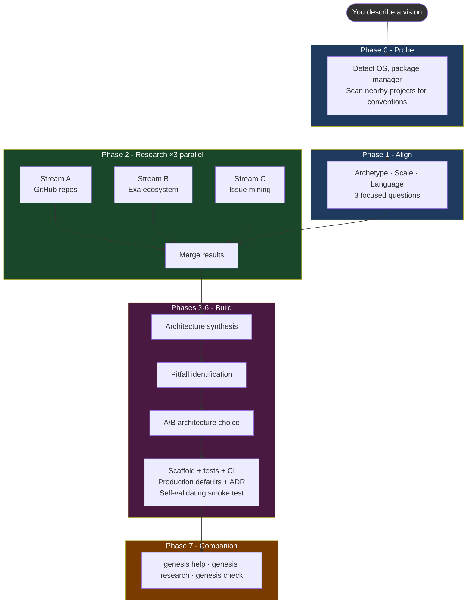

<div align="center">

# Genesis Architect

**Research first. Build once.**
The only scaffolder that verifies its sources before building.

[](CHANGELOG.md)
[](LICENSE)
[](https://github.com/anthropics/claude-code)
[](https://github.com/maioio/genesis-architect/actions)

[](SKILL.md)
[](references/architecture-patterns.md)
[](SKILL.md)
[](evals/test_queries.json)

<br/>

> Scans 15-20 real GitHub repos, deep-analyzes the top 5-8, and mines their Issues for pitfalls -
> **before writing a single file.**
> No other scaffolding tool does this automatically.

<br/>


</div>

---

## The problem with every other scaffolding tool

Every tool - `create-t3-app`, `bolt.new`, Copilot Workspace, Cookiecutter - assumes you already know what to build and how. They generate code from templates, not from evidence.

Genesis Architect treats scaffolding as a **research problem first**.

```
You describe a vision
       ↓
Genesis scans 15-20 real repos, deeply analyzes top 5-8
       ↓
It mines their GitHub Issues for what broke in production
       ↓
It builds a scaffold that avoids those mistakes
       ↓
It stays active as a research partner while you build
```

---

## How it works



> [!NOTE]
> **Three hard gates protect you:** Phase 2 stops if fewer than 5 repos found. Phase 5 requires an explicit A/B/C/D choice. Phase 6 blocks `git commit` until the smoke test passes.

---

## Install

```bash
# Claude Code (recommended)
git clone https://github.com/maioio/genesis-architect ~/.claude/skills/genesis-architect

# Via skills.sh (any agent)
npx skills add maioio/genesis-architect

# Cursor
# Copy SKILL.md to .cursor/rules/genesis-architect.md

# Codex CLI
git clone https://github.com/maioio/genesis-architect ~/.codex/skills/genesis-architect
```

No build step, no dependencies.

---

## Usage

<details>
<summary><b>Explicit commands</b></summary>

```
genesis init a REST API in TypeScript
genesis init a Python CLI for batch image processing
genesis init a Chrome extension that does X
genesis init --from-prd PRD.md          # read a product spec, skip Phase 1
genesis init --from-team-config          # restore a teammate's research
genesis audit ./my-existing-project      # audit existing code, no scaffold
```

</details>

<details>
<summary><b>Natural triggers - just describe what you want</b></summary>

```
I want to build a Telegram bot
scaffold a new project for web scraping
start building a VS Code extension
I need to build a data pipeline from scratch
create a tool that converts CSV to JSON
```

</details>

---

## What every project gets

| Deliverable | Contents |
|-------------|----------|
| `RESEARCH.md` | 15-20 repos scanned, top 5-8 deeply analyzed, sources linked, ecosystem velocity signals |
| `PITFALLS.md` | 3-7 real pitfalls from GitHub Issues with root causes and mitigations |
| `ROADMAP.md` | 5-10 phase development plan calibrated to research complexity |
| `src/` | Functional boilerplate - not empty stubs |
| `tests/` | Passing unit tests for core logic |
| `.github/workflows/ci.yml` | Language-specific GitHub Actions CI/CD |
| `docs/adr/001-initial-architecture.md` | Every architectural decision explained with evidence |
| `.gitignore` | Language-appropriate, generated before first commit |

**Production-readiness defaults baked into every scaffold:**

| Default | What it does |
|---------|-------------|
| Structured logging | `pino`/`winston`/`slog` from line 1 - no `console.log` in production |
| Non-root Dockerfile | `USER 1001` - never runs as root |
| Env validation | Fails loudly at startup if required vars are missing |
| `GET /health` | Returns `{"status":"ok"}` (Web Service archetype) |
| No wildcard CORS | Explicitly listed origins only |
| Secret Zero | `.env.example` with generation hint, validated at startup |

---

## Languages and archetypes

**Languages** auto-detected from research:

```
TypeScript / JavaScript    Python    Go    Rust
```

**Archetypes** - each shapes the entire scaffold differently:

| Archetype | Entrypoint | Has server | Has Dockerfile | Test runner |
|-----------|-----------|-----------|----------------|-------------|
| ✅ CLI Tool | `bin` / `[project.scripts]` | No | Optional | pytest / jest |
| 📦 Library/SDK | Public API, no `main()` | No | No | pytest / jest |
| 🌐 Web Service/API | Router | Yes | Yes + `/health` | pytest / jest |
| 🖥️ Frontend App | Component tree | No (SSR optional) | Optional | vitest / jest |

---

## Why not just use X?

| Capability | Genesis Architect | create-t3-app | bolt.new | Cursor Rules | madison/scaffolding |
|-----------|:-----------------:|:-------------:|:--------:|:------------:|:-------------------:|
| Research from real GitHub Issues | ✅ | ❌ | ❌ | ❌ | ❌ |
| Validates citations (no hallucinated repos) | ✅ | n/a | ❌ | n/a | ❌ |
| Anti-hallucination CVE check (OSV.dev) | ✅ | ❌ | ❌ | ❌ | ❌ |
| Research Quality Signal (FULL/PARTIAL/THIN) | ✅ | ❌ | ❌ | ❌ | ❌ |
| Hard gates before file creation | ✅ | ❌ | ❌ | ❌ | ✅ |
| Drift detection (endpoint inventory) | Planned | ❌ | ❌ | ❌ | ✅ |
| Quality rubric with measured score | ✅ | ❌ | ❌ | ❌ | ❌ |
| Works without any MCP | ✅ | n/a | n/a | n/a | n/a |
| PRD-driven flow (`--from-prd`) | ✅ | ❌ | ❌ | ❌ | ❌ |
| WSL detection | ✅ | ❌ | ❌ | ❌ | ❌ |

---

## Works at every level of MCP setup

| Setup | Research quality | Speed |
|-------|-----------------|-------|
| No MCPs | Web search - real repos, shallower issue data | Normal |
| GitHub MCP | Deep repo scan + real Issue extraction | Normal |
| GitHub + Exa | Full parallel: repos + Reddit/HN/SO context | **~3x faster** |
| GitHub + Exa + Firecrawl | Full parallel + targeted page scraping | **~3x faster** |

> [!TIP]
> The skill never blocks on a missing tool. It reports what it's using and continues.

---

## Development Companion Mode

After scaffolding, Genesis Architect stays active for the rest of your session:

```
genesis help I need to add rate limiting      → searches Phase 2 repos for how they solved it
genesis research authentication patterns      → targeted scan with 1-3 ranked approaches
genesis check                                 → freshness audit: CVEs, outdated deps, CI versions
```

In a new session, it reads `RESEARCH.md` from your project to restore context automatically.

---

## Real output - not fabricated

From an actual TypeScript CLI project:

- [`examples/typescript-cli/RESEARCH.md`](examples/typescript-cli/RESEARCH.md) - 17 repos analyzed, every source linked
- [`examples/typescript-cli/PITFALLS.md`](examples/typescript-cli/PITFALLS.md) - 4 real pitfalls from GitHub Issues, mitigations built into the scaffold
- [`examples/typescript-cli/ROADMAP.md`](examples/typescript-cli/ROADMAP.md) - 5-phase plan calibrated to what the research found

---

## Project structure

<details>
<summary><b>Full layout</b></summary>

```
genesis-architect/
├── SKILL.md                        # Skill definition (400 lines)
├── plugin.json                     # Marketplace manifest
├── scripts/
│   ├── scaffold_generator.py       # Creates project structure from language + tier
│   ├── research_validator.py       # Validates RESEARCH.md has all required sections
│   └── eval_runner.py              # Measures trigger rate (target: ≥90%)
├── evals/
│   ├── test_queries.json           # 36 trigger/no-trigger test cases (100% accuracy)
│   └── README.md
├── examples/
│   └── typescript-cli/             # Real output from a real project
│       ├── RESEARCH.md
│       ├── PITFALLS.md
│       └── ROADMAP.md
├── assets/
│   ├── RESEARCH.template.md        # Source of truth for validator
│   ├── PITFALLS.template.md
│   └── ROADMAP.template.md
├── references/
│   ├── architecture-patterns.md    # Boilerplate per language/tier + production defaults
│   └── mcp-strategy.md             # MCP tool strategy and fallback logic
├── .github/
│   └── workflows/
│       └── ci.yml                  # Validates templates, runs evals, smoke-tests scaffold
├── CHANGELOG.md
└── CONTRIBUTING.md
```

</details>

---

## Quality Score

Measured against the [quality rubric](evals/quality_rubric.md) (100-point, 4 dimensions):

| Run | Type | Score |
|-----|------|-------|
| [typescript-cli example](examples/typescript-cli/) | TypeScript CLI | **72/100** (measured) |
| Python CLI | - | 70/100 (projected) |
| Go service | - | 68/100 (projected) |
| Rust CLI | - | 67/100 (projected) |
| React app | - | 69/100 (projected) |

**Average: 69/100.** Target for v2.0.0 release: 80+. Primary gap: Section 4 (Phase Correctness) cannot be fully scored from static output alone - session transcripts needed. Section 3 gap: Go/Rust scaffold templates thinner than TypeScript/Python.

---

## Honest Limitations

| Limitation | Details |
|-----------|---------|
| **Issue mining depth** | Scans 50 most-recent issues across 5-8 repos. Low-traffic projects or issues closed years ago may not surface. |
| **Web-search-only mode** | Without GitHub MCP, issue extraction is shallow. RESEARCH.md will note this automatically. |
| **Quick experiment trigger** | Natural-language triggers ("I want to build X") now ask intent first - but `genesis init` always runs the full flow. |
| **Issue URL authenticity** | Run `python scripts/research_validator.py RESEARCH.md --verify-issues` to HTTP-check every cited GitHub issue URL. CI does format-check only; live verification is opt-in to avoid rate limits. |
| **WSL** | On Windows, if you're running inside WSL, Linux paths and package managers are used - Windows PATH fixes do not apply. |

---

## Contributing

See [CONTRIBUTING.md](CONTRIBUTING.md).

New language templates, improved MCP strategies, and workflow refinements are welcome.

> [!IMPORTANT]
> Keep SKILL.md under 400 lines. No em dashes anywhere. All code, filenames, and comments in English.

## License

[MIT](LICENSE) - Maio Eshet

---

<div align="center">

If Genesis Architect saved you from a bad architecture decision, a ⭐ helps others find it.

</div>
