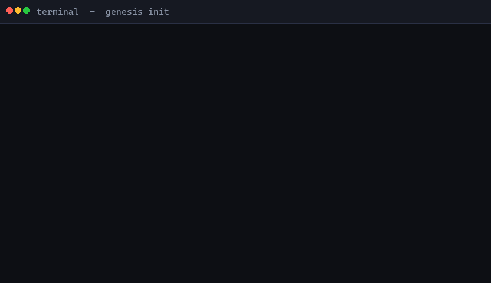

<div align="center">

# Genesis Architect

**Most projects fail because developers repeat mistakes that were already solved in other repositories.**

Genesis Architect scans GitHub before you write code. It finds the common failures, bugs, and design pitfalls
that real developers hit building the same thing - then generates a scaffold with those mitigations already built in.

[](https://github.com/maioio/genesis-architect/actions)
[](CHANGELOG.md)
[](LICENSE)
[](https://github.com/anthropics/claude-code)
[](https://snyk.io/test/github/maioio/genesis-architect)

[](https://sonarcloud.io/summary/new_code?id=maioio_genesis-architect)
[](https://sonarcloud.io/summary/new_code?id=maioio_genesis-architect)
[](https://sonarcloud.io/summary/new_code?id=maioio_genesis-architect)
[](https://sonarcloud.io/summary/new_code?id=maioio_genesis-architect)

[](SKILL.md)
[](references/architecture-patterns.md)
[](SKILL.md)
[](tests/)
[](evals/test_queries.json)
[](https://github.com/maioio/genesis-architect/stargazers)

[](https://github.com/sponsors/maioio)
[](https://buymeacoffee.com/maioio)

<br/>



**If this saved you from a bad architecture decision - [star it](https://github.com/maioio/genesis-architect/stargazers). It helps others find it.**

</div>

---

## What it actually produces

Run: `genesis init a Python CLI for analyzing log files`

**Pitfalls found from real GitHub Issues (before a single file is written):**

| # | Issue | Found in | Root cause | Built-in mitigation |
|---|-------|----------|-----------|---------------------|
| 1 | [pallets/click#2416](https://github.com/pallets/click/issues/2416) | 4/5 repos | Business logic inside Click callback - untestable | `cli.py` only parses args, all logic in `core.py` |
| 2 | [pallets/click#2558](https://github.com/pallets/click/issues/2558) | 3/5 repos | Type stubs change in Click 8.1.4 breaks mypy silently | Pin `click>=8.1.7`, `# type: ignore` only where needed |
| 3 | [pallets/click#1846](https://github.com/pallets/click/issues/1846) | 3/5 repos | Raw file path from CLI args allows `../../../etc/passwd` | `get_safe_path(base, user_input)` in `utils/security.py` |
| 4 | [fastapi/typer#522](https://github.com/fastapi/typer/issues/522) | 5/5 repos | No input validation produces cryptic tracebacks as errors | `click.BadParameter` at entry point before any processing |

**Scaffold generated (12 files, 0 empty stubs):**

```
log-analyzer/
├── src/log-analyzer/
│   ├── __init__.py
│   ├── main.py        # Click CLI - args only, delegates to core
│   ├── core.py        # All logic lives here, testable without subprocess
│   └── utils/
│       └── security.py  # get_safe_path() - path traversal guard
├── tests/
│   ├── __init__.py
│   └── test_core.py   # Tests core directly, no subprocess needed
├── .github/workflows/ci.yml  # 4 jobs: tests, secrets, SAST, quality gate
├── .env.example
├── pyproject.toml     # click>=8.1.7 pinned, mypy strict, pytest config
├── RESEARCH.md        # 5 repos analyzed, all sources verified live
├── PITFALLS.md        # The 4 pitfalls above with full root cause analysis
└── ROADMAP.md         # 5-phase plan: scaffold -> tests -> CI -> quality -> ship
```

Every cited issue URL is verified by CI. A 404 fails the build.

---

## When NOT to use Genesis

> Honesty matters. Genesis is overkill for some things.

**Skip Genesis if you are building:**
- A tiny script (under 100 lines, no tests needed)
- A throwaway experiment or one-off utility
- A single-file tool you will delete in a week
- Something with zero external dependencies

**Use Genesis if you are building:**
- A project you plan to maintain for more than a month
- Anything with authentication, file I/O, or external APIs
- A library or SDK other people will depend on
- Something you want to ship without hitting the same bugs everyone else hit

---

## Install

```bash
# Claude Code (recommended)
git clone https://github.com/maioio/genesis-architect ~/.claude/skills/genesis-architect

# Cursor
# Copy SKILL.md to .cursor/rules/genesis-architect.md

# Codex CLI
git clone https://github.com/maioio/genesis-architect ~/.codex/skills/genesis-architect
```

No build step, no dependencies.

---

## Usage

```bash
# Full research mode (default) - 15-20 repos, full Issue mining
genesis init a REST API in TypeScript
genesis init a Python CLI for batch image processing
genesis init a Chrome extension that does X

# Fast MVP mode - research capped at 5 min, then immediately builds
genesis init --fast-mvp a Discord bot in Python

# Development Partner Mode - asks before every major decision
genesis init --partner a SaaS billing system

# Read a product spec, skip the questions
genesis init --from-prd PRD.md

# Audit an existing project
genesis audit ./my-existing-project

# Inject security gates into any project
genesis harden ./my-existing-project

# Smart Resolution with local vault
genesis resolve path traversal python
```

Or just describe what you want:

```
I want to build a Telegram bot
scaffold a new project for web scraping
start building a VS Code extension
```

---

## Natural Language Routing

You never need to know command names. Genesis detects what you want from normal language and routes to the right workflow automatically.

| What you say | What Genesis does |
|---|---|
| "I have an idea. Check if it is worth building." | Founder mode: market research, competitor analysis, PRODUCT_STRATEGY.md |
| "Build me a quick working version." | Fast MVP mode: 5 min research cap, builds immediately |
| "This project is broken. Figure out what is wrong." | Recovery mode: reads project state, diagnoses, proposes fix order |
| "Review this project before I continue." | Audit mode: Phases 2-4 on existing code, PITFALLS.md delivered |
| "Continue from where we stopped." | Resume mode: reads state, restores context, picks up from last step |
| "Just do research, don't build yet." | Research-only mode: Phases 2-4, no scaffold |
| "Does this work?" | Validation mode: smoke test + MVP validation checks |

When Genesis is confident, it routes immediately and announces why. When unsure, it asks one short question before proceeding. Commands like `genesis init`, `genesis audit`, and `genesis harden` still work for power users.

---

## How it works

Before writing a single file, Genesis runs research across real GitHub repos:

1. **Finds 15-20 repos** similar to what you are building (filtered by stars, recency, language)
2. **Mines GitHub Issues** from the top repos - up to 50 closed issues each - extracting recurring failures, security patches, and architecture regrets
3. **Synthesizes the wise average** of what actually survives in production across those repos
4. **Generates a scaffold** where every pitfall found becomes a concrete code task - not a document to read later

The difference from templates: the scaffold reflects what broke for the people who built this before you.

---

## Fast MVP mode

```bash
genesis init --fast-mvp a REST API
```

Research is capped at 5 minutes, 10 repos, 30 issues. Genesis then immediately builds instead of asking questions. Output is a single `BUILD_PACKET.md` with each pitfall as a concrete code task, plus the full scaffold.

Use this when you want a running project in under 10 minutes and are willing to trade some research depth.

---

## Development Partner Mode

Genesis V5.1 does not make major decisions silently.

Before choosing an architecture, defining MVP scope, selecting a technology, or making a product direction call - Genesis presents options, explains the tradeoff, and waits.

**The rule:** fewer, better-timed questions. Not more questions. Less rework.

### Experience Selection

When you describe a project in natural language, Genesis asks once:

```
What kind of Genesis experience?

A: Fast Build     - quick MVP, minimal questions (hackathon / experiment)
B: Professional   - structured research and validation  [Recommended]
C: Founder        - market research, competitor analysis, product strategy
D: Auto           - Genesis infers from your description and announces its choice
```

Pick your mode once. Genesis adjusts research depth, question count, and output files accordingly.

### Question format for major decisions

When Genesis needs your input on something that matters:

```
Should this API use a database or in-memory state?

A: In-memory dict       - zero dependencies, no persistence across restarts
B: SQLite               - file-based, no server needed, survives restarts
C: PostgreSQL           [Recommended]
D: Let me decide later

Why C: 3 of 5 analyzed repos moved from SQLite to Postgres under load - migration cost is high.
Risk if you choose B: you will likely migrate later when concurrent writes break.
Press Enter to accept C, or type A/B/D.
```

### What Genesis asks before vs. what it decides alone

| Genesis MUST ask before | Genesis decides alone |
|---|---|
| Architecture: Minimalist vs Scalable | File names |
| MVP scope: what is in / what is out | Folder structure details |
| Technology: when tradeoffs are real | Formatting and linting choices |
| Product direction: target user, pivots | Small implementation details |
| Business: monetization, open vs commercial | Internal refactors |

### Companion Mode stays active

Development Partner rules do not expire after the scaffold. They remain active through Phase 7 (Companion Mode) for the lifetime of the project.

---

## What every project gets

| Deliverable | Contents |
|-------------|----------|
| `RESEARCH.md` | 15-20 repos scanned, top repos deeply analyzed, sources linked |
| `PITFALLS.md` | 3-7 real pitfalls from GitHub Issues with root causes and mitigations |
| `ROADMAP.md` | 5-10 phase development plan |
| `src/` | Functional code - not empty stubs |
| `tests/` | Passing unit tests for core logic |
| `.github/workflows/ci.yml` | 4 parallel jobs: tests, secret scanning, SAST, code quality gate |
| `utils/security.py` or `security.ts` | `get_safe_path` guard for all file I/O (when applicable) |
| `docs/adr/001-initial-architecture.md` | Every architectural decision explained with evidence |
| `.gitignore` | Language-appropriate, hardened against secrets and build artifacts |
| `.pre-commit-config.yaml` | Genesis enforcement hooks: mitigation enforcer + drift detector |

**Production defaults baked into every scaffold:**

| Default | What it does |
|---------|-------------|
| Structured logging | `pino`/`winston`/`slog` from line 1 - no `console.log` in production |
| Non-root Dockerfile | `USER 1001` - never runs as root |
| Env validation | Fails loudly at startup if required vars are missing |
| `GET /health` | Returns `{"status":"ok"}` (Web Service archetype) |
| No wildcard CORS | Explicitly listed origins only |
| Secret Zero | `.env.example` with generation hint, validated at startup |
| Secret scanning CI | Every push scanned - build fails on exposed credentials |
| SAST analysis CI | Static analysis catches injection and path traversal on every push |

---

## Free vs Pro

Genesis Architect is open-core. The free package below is a complete,
usable tool. Pro adds the deep research intelligence layer.

| Capability | Free | Pro |
|------------|:----:|:---:|
| Full scaffolder (Python, TS, Go, Rust) | yes | yes |
| CI/CD, security defaults, templates | yes | yes |
| Top 3 GitHub pitfalls per project | yes | yes |
| Multi-source pitfall ranking | - | yes |
| Video-to-pitfall (YouTube, Reddit) | - | yes |
| Package-registry validation (PyPI, npm, crates) | - | yes |
| Cross-session memory | - | yes |
| Recovery scan for existing projects | - | yes |

Pro installs alongside the free core and lights up automatically:

```bash
pip install genesis-architect-pro
export GENESIS_PRO_LICENSE=<your-key>
genesis upgrade   # check status
```

Run `genesis upgrade` any time to see what is unlocked.

### Get Pro

**Founder's pricing - first 50 customers only:**

- **$9/month** per developer, or
- **$90/year** (two months free)

These 50 founders keep this price for life. After 50 seats, Pro moves to
standard pricing ($19/month or $190/year).

1. Buy a license: [Yearly - $90](https://eshetmaio.gumroad.com/l/kzbpct) or [Monthly - $9](https://eshetmaio.gumroad.com/l/dduhm)
2. You receive a license key and access to the Pro package.
3. Install and activate:

```bash
pip install genesis-architect-pro
export GENESIS_PRO_LICENSE=<your-key>
genesis upgrade
```

Questions or team licensing: open an issue or email maio.eshet@gmail.com

---

## How it compares

Every other tool - `create-t3-app`, `bolt.new`, Copilot Workspace, Cookiecutter - generates code from templates. They have no idea what broke in production for the developers who built the same thing before you.

| Capability | Genesis Architect | create-t3-app | bolt.new | Cursor Rules |
|-----------|:-----------------:|:-------------:|:--------:|:------------:|
| Research from real GitHub Issues | Yes | No | No | No |
| Validates citations (no hallucinated repos) | Yes | n/a | No | n/a |
| Hard gates before file creation | Yes | No | No | No |
| Development Partner Mode (asks before major decisions) | Yes | No | No | No |
| Secret scanning + SAST on every scaffold | Yes | No | No | No |
| Retrofit security into existing projects | Yes | No | No | No |
| Smart Resolution Engine with local vault | Yes | No | No | No |
| Stays active for entire project lifecycle | Yes | No | No | No |

> Assessments based on public documentation as of 2026.

---

## Works at every level of MCP setup

| Setup | Research quality | Speed |
|-------|-----------------|-------|
| No MCPs | Web search - real repos, shallower issue data | Normal |
| GitHub MCP | Deep repo scan + real Issue extraction | Normal |
| GitHub + Exa | Full parallel: repos + Reddit/HN/SO context | ~3x faster |
| GitHub + Exa + Firecrawl | Full parallel + targeted page scraping | ~3x faster |

> The skill never blocks on a missing tool. It reports what it is using and continues.

---

## Smart Resolution Engine

`genesis resolve [topic]` checks a local vault first (instant, no API call), then falls back to Stack Overflow.

```bash
$ genesis resolve "csv streaming large file python"

Smart Resolution Engine
Query: 'csv streaming large file python'
Source: Stack Overflow community answers

============================================================
Result 1: Streaming CSV from S3 to Python
  Score: 16  |  Answers: 5  |  Tags: python, boto3
  [TOP ANSWER: score 11]  [type: classic]

  Use chunked reading: read a block, find the last newline, process.
  chunk_size = 1_000_000 ...

  Source: https://stackoverflow.com/a/51142062
============================================================

IMPORTANT: Always review community solutions before applying.
Genesis Architect never patches your code without your confirmation.
```

Every resolved solution is saved to `.genesis/vault/` and returned instantly on the next query.

No API key required (300 requests/day). Set `STACKOVERFLOW_KEY` for 10,000/day.

---

## Development Companion Mode

After scaffolding, Genesis stays active for the rest of your session:

```
genesis help I need to add rate limiting    -> searches Phase 2 repos for how they solved it
genesis research authentication patterns    -> targeted scan with 1-3 ranked approaches
genesis check                              -> freshness audit: CVEs, outdated deps, CI versions
genesis resolve path traversal python      -> Smart Resolution Engine with vault-first lookup
```

---

## Languages and archetypes

**Languages** auto-detected from research:

```
TypeScript / JavaScript    Python    Go    Rust
```

**Archetypes** - each shapes the entire scaffold differently:

| Archetype | Entrypoint | Has server | Has Dockerfile | Test runner |
|-----------|-----------|-----------|----------------|-------------|
| CLI Tool | `bin` / `[project.scripts]` | No | Optional | pytest / jest |
| Library/SDK | Public API, no `main()` | No | No | pytest / jest |
| Web Service/API | Router | Yes | Yes + `/health` | pytest / jest |
| Frontend App | Component tree | No (SSR optional) | Optional | vitest / jest |

---

## Real output - not fabricated

From actual projects:

**TypeScript CLI:**
- [`examples/typescript-cli/RESEARCH.md`](examples/typescript-cli/RESEARCH.md) - 5 repos analyzed, every source linked and verified
- [`examples/typescript-cli/PITFALLS.md`](examples/typescript-cli/PITFALLS.md) - 4 real pitfalls from live GitHub Issues
- [`examples/typescript-cli/ROADMAP.md`](examples/typescript-cli/ROADMAP.md) - 5-phase plan calibrated to research findings

**Python CLI:**
- [`examples/python-cli/RESEARCH.md`](examples/python-cli/RESEARCH.md) - click, typer, python-fire, tqdm, prompt-toolkit analyzed
- [`examples/python-cli/PITFALLS.md`](examples/python-cli/PITFALLS.md) - 4 pitfalls: click#2416, click#2558, tqdm#1139, typer#522 - all verified
- [`examples/python-cli/src/`](examples/python-cli/src/) - working Python CLI with Click, get_safe_path, and full test suite

---

## What contributors found

> First external contributor [@nitayk](https://github.com/nitayk) opened 7 issues and submitted a 444-line PR with a self-contained code review - finding and fixing 4 bugs - within 48 hours of launch.

---

## Honest Limitations

| Limitation | Details |
|-----------|---------|
| **Issue mining depth** | Scans up to 50 most-recent issues across repos. Low-traffic projects or old issues may not surface. |
| **Web-search-only mode** | Without GitHub MCP, issue extraction is shallow. RESEARCH.md will note this automatically. |
| **Stack Overflow API limit** | 300 requests/day unauthenticated. Set `STACKOVERFLOW_KEY` for 10,000/day. Vault hits bypass this entirely. |
| **Fork intelligence** | Scanning active forks for upstream patches requires GitHub MCP. Without it, fork analysis is skipped. |
| **WSL** | On Windows inside WSL, Linux paths and package managers are used - Windows PATH fixes do not apply. |

---

## Project structure

<details>
<summary><b>Full layout</b></summary>

```
genesis-architect/
├── SKILL.md                        # Skill definition - the brain
├── plugin.json                     # Marketplace manifest
├── scripts/
│   ├── scaffold_generator.py       # Creates project structure
│   ├── research_validator.py       # Validates RESEARCH.md + live GitHub URL checks
│   ├── resolve_engine.py           # Smart Resolution Engine (Stack Overflow API + vault)
│   ├── vault.py                    # Knowledge Vault - local solution cache
│   ├── genesis_state.py            # Phase 5/6 hard gate state files
│   ├── genesis_subcommands.py      # genesis check: CVE scan + CI action audit
│   ├── pitfall_coverage_check.py   # Verifies PITFALLS.md mitigations exist in source
│   ├── drift_detector.py           # Architecture drift detection vs ADR baseline
│   ├── issue_miner.py              # GitHub Issue mining (GraphQL + REST)
│   ├── feedback.py                 # Pitfall feedback recorder
│   ├── env_probe.py                # Phase 0 environment detection
│   └── eval_runner.py              # Trigger rate eval + schema validation
├── tests/                          # 372 unit tests
├── evals/
│   ├── test_queries.json           # 40 trigger/no-trigger test cases (100% accuracy)
│   └── README.md
├── examples/
│   ├── typescript-cli/
│   └── python-cli/
├── references/
│   ├── architecture-patterns.md    # Boilerplate per language/tier + production defaults
│   ├── mcp-strategy.md             # MCP tool strategy and fallback logic
│   └── security-templates.md       # CI templates for secret scanning, SAST, quality gate
├── .github/
│   ├── dependabot.yml
│   └── workflows/
│       ├── ci.yml
│       └── codeql.yml
├── pyproject.toml
├── CHANGELOG.md
├── SECURITY.md
└── CONTRIBUTING.md
```

</details>

---

## Quality Shield

Four CI jobs run on every push and pull request:

| Job | What it gates | Secret required |
|-----|--------------|-----------------|
| `quality-gates` | 372 unit tests, evidence pack generation, mitigation enforcement, drift detection, scaffold smoke test, SKILL.md constraints | `GITHUB_TOKEN` (built-in) |
| `secrets-scan` | Exposed credentials, API keys, tokens in every commit | none |
| `sonarcloud` | Maintainability, Reliability, Security Hotspots; skips if SONAR_TOKEN absent | `SONAR_TOKEN` |
| `security-scan` | Dependency CVEs (HIGH+) via Snyk; skips if SNYK_TOKEN absent | `SNYK_TOKEN` |

**To activate optional jobs:** set repository Variables in Settings > Secrets and variables > Actions > Variables:
- `SONAR_ENABLED` = `true` (then add `SONAR_TOKEN` as a Secret)
- `SNYK_ENABLED` = `true` (then add `SNYK_TOKEN` as a Secret)

> [!IMPORTANT]
> After connecting SonarCloud, disable **Automatic Analysis** in SonarCloud project settings. Running both simultaneously causes the quality-gate job to fail.

---

## Roadmap

| Priority | Feature | Status |
|----------|---------|--------|
| 1 | Demo GIF | Pending |
| 2 | Go and Rust real-world example projects | In progress |
| 3 | Benchmark report: Genesis vs plain Claude on real projects | Planned |
| 4 | Interactive CLI with progress bars | Planned |
| 5 | VS Code extension | Planned |

Community contributions welcome - see [CONTRIBUTING.md](CONTRIBUTING.md).

---

## Community

- **Share your output**: open a PR adding your `RESEARCH.md` and `PITFALLS.md` to `examples/`
- **Report missed pitfalls**: if something slipped past the research phase, open an issue
- **Good first issues**: check the [`good first issue`](https://github.com/maioio/genesis-architect/issues?q=label%3A%22good+first+issue%22) label

[Open an issue](https://github.com/maioio/genesis-architect/issues) | [Submit a PR](https://github.com/maioio/genesis-architect/pulls) | [Discussions](https://github.com/maioio/genesis-architect/discussions)

---

## Support this project

Genesis Architect is free and open-source. If it saved you from a bad architecture decision or production incident:

[](https://github.com/sponsors/maioio)
[](https://buymeacoffee.com/maioio)

---

## Contributing

See [CONTRIBUTING.md](CONTRIBUTING.md).

> [!IMPORTANT]
> Keep SKILL.md under 400 lines. No em dashes anywhere. All code, filenames, and comments in English.

## License

[MIT](LICENSE) - Maio Eshet

---

<div align="center">

**[Star this repo](https://github.com/maioio/genesis-architect/stargazers) if Genesis Architect saved you from a bad architecture decision. It helps others find it.**

[Issues](https://github.com/maioio/genesis-architect/issues) · [Discussions](https://github.com/maioio/genesis-architect/discussions) · [CHANGELOG](CHANGELOG.md)

</div>
