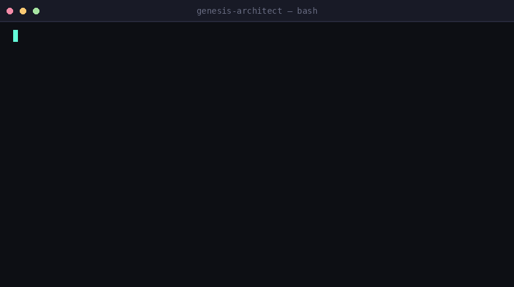
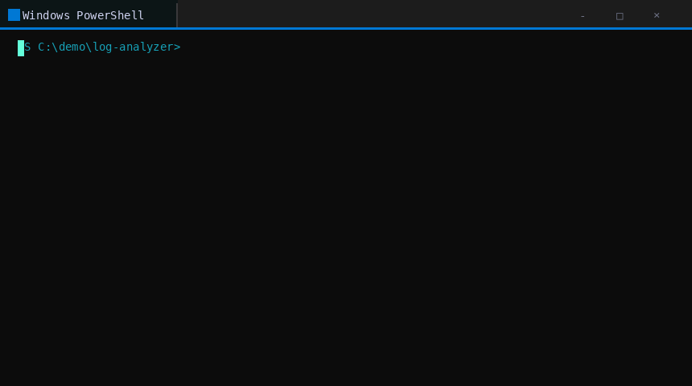

# Genesis Architect

**Research first. Build once.**

[](LICENSE)
[](CHANGELOG.md)
[](https://github.com/anthropics/claude-code)
[](https://github.com/maioio/genesis-architect/actions)
[](https://github.com/maioio/genesis-architect)

A Claude Code skill that scans 15-20 real GitHub repos, extracts pitfalls from actual Issues,
and builds a battle-tested scaffold - before writing a single line of code.

After scaffolding, enters **Development Companion Mode**: keeps searching and suggesting as you build.

---

## Demo

<table align="center"><tr>
<td align="center"><b>macOS</b><br/></td>
<td align="center"><b>Windows</b><br/></td>
</tr></table>

> `genesis init a Python CLI for log analysis` → 18 repos scanned → scaffold complete in under 3 minutes.

**Full interactive recording** (pause, rewind, copy text from terminal):
[](https://asciinema.org/a/genesis-architect-demo)

> The GIFs above are for quick preview. The asciinema recording lets you pause, rewind, and copy
> commands directly. Record your own session with `asciinema rec demo.cast` and convert to GIF
> with `agg demo.cast demo.gif` if you need a static file for platforms that block scripts.

---

## See it in action

Real output from a TypeScript CLI project - not fabricated:

- [`examples/typescript-cli/RESEARCH.md`](examples/typescript-cli/RESEARCH.md) - 17 repos analyzed, sources linked
- [`examples/typescript-cli/PITFALLS.md`](examples/typescript-cli/PITFALLS.md) - 4 real pitfalls from GitHub Issues
- [`examples/typescript-cli/ROADMAP.md`](examples/typescript-cli/ROADMAP.md) - 5-phase development plan

This is what you get. If the quality here looks useful, the skill is worth trying.

---

## Without MCPs

Genesis Architect works at three levels depending on your setup:

| Setup | What you get |
|-------|-------------|
| No MCPs (default) | Web search only - finds public repos, shallower issue analysis |
| GitHub MCP | Deep repo scan + real issue extraction (recommended) |
| GitHub + Exa | Full research: repos + Reddit/HN/StackOverflow ecosystem context |

The skill never blocks on a missing tool - it reports what it's using and continues.
Web search alone still finds real repos and real pitfalls; it's slower and less deep.

---

## Install

```bash
git clone https://github.com/maioio/genesis-architect ~/.claude/skills/genesis-architect
```

---

## Usage

**Explicit invocation:**
```
genesis init a REST API in TypeScript
genesis init a Chrome extension that does X
genesis init a Python CLI for batch image processing
genesis init --from-prd PRD.md          # ← from a product spec
genesis init --from-team-config          # ← restore teammate's research
genesis audit ./my-existing-project      # ← audit existing code
```

**Natural triggers:**
```
I want to build a Telegram bot
scaffold a new project for web scraping
start building a VS Code extension
```

---

## What you get

Every project receives:

| File | Contents |
|------|----------|
| `RESEARCH.md` | Market analysis of 15-20 real repos, sources linked |
| `PITFALLS.md` | 3-7 real pitfalls from GitHub Issues with mitigations |
| `ROADMAP.md` | 5-10 phase development roadmap |
| `src/` | Functional boilerplate (not empty stubs) |
| `tests/` | Passing unit tests for core logic |
| `.github/workflows/ci.yml` | GitHub Actions CI/CD |

---

## The 8 phases

| Phase | What happens |
|-------|-------------|
| 0. Environment Probe | Detects OS, Python version, package manager, PATH |
| 1. Vision Alignment | 2-3 focused questions about scope and scale |
| 2. Deep Discovery | Scans 15-20 repos, reads last 50 issues each |
| 3. Architecture Analysis | Synthesizes the "wise average" across the ecosystem |
| 4. Pitfall Identification | Extracts recurring failures with root causes |
| 5. Interactive Choice | Minimalist vs. Scalable architecture options |
| 6. Genesis Build | Creates scaffold with tests and CI/CD |
| 7. Development Companion | Keeps searching and suggesting as you build |

---

## Development Companion Mode

After scaffolding, Genesis Architect stays active within the session. Tell it what you're working on:

```
genesis help I need to add authentication
genesis research rate limiting patterns
```

It searches the repos it already analyzed and returns grounded suggestions - not generic advice.

**Session scope**: The companion remembers the research from Phases 2-4 within the current Claude Code session. In a new session, it reads `RESEARCH.md` from your project folder to restore context - this is why that file is a mandatory deliverable.

---

## Languages supported

Auto-detected from research. Built-in templates for:
- TypeScript / JavaScript
- Python
- Go
- Rust

---

## MCP tool chain

| Priority | Tool | Purpose |
|----------|------|---------|
| 1 | GitHub MCP | Repo analysis, issue scanning |
| 2 | Exa MCP | Reddit, HN, StackOverflow |
| 3 | Firecrawl MCP | Targeted page scraping |
| 4 | Web search | Fallback |

All tools optional - skill degrades gracefully.

---

## Project structure

```
genesis-architect/
├── SKILL.md                        # Skill definition (under 400 lines)
├── plugin.json                     # Manifest for skill marketplaces
├── scripts/
│   ├── scaffold_generator.py       # Creates project structure
│   ├── research_validator.py       # Validates RESEARCH.md completeness
│   └── eval_runner.py              # Measures trigger rate
├── evals/
│   ├── test_queries.json           # 31 trigger/no-trigger test cases
│   └── README.md                   # How to run evals
├── examples/
│   └── typescript-cli/             # Real output example
│       ├── RESEARCH.md
│       ├── PITFALLS.md
│       └── ROADMAP.md
├── assets/
│   ├── RESEARCH.template.md
│   ├── PITFALLS.template.md
│   └── ROADMAP.template.md
├── references/
│   ├── architecture-patterns.md    # Boilerplate per language/tier
│   └── mcp-strategy.md             # MCP usage and fallback logic
├── FEEDBACK.md                     # Field feedback from real project runs
└── CLAUDE.md                       # Claude Code project instructions
```

---

## Contributing

See [CONTRIBUTING.md](CONTRIBUTING.md) to add language templates or improve the workflow.

## License

[MIT](LICENSE) - Maio Eshet
