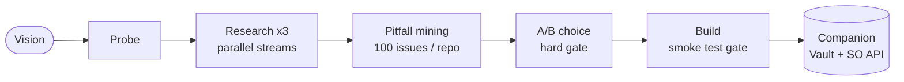

<div align="center">

# Genesis Architect

**Research-first project scaffolding for Claude Code.**
Scans 15-20 real GitHub repos, mines their Issues for production failures,
builds your project to avoid them - then stays active as your architect.

[](https://github.com/maioio/genesis-architect/actions)
[](CHANGELOG.md)
[](LICENSE)
[](https://github.com/anthropics/claude-code)

[](https://sonarcloud.io/summary/new_code?id=maioio_genesis-architect)
[](https://sonarcloud.io/summary/new_code?id=maioio_genesis-architect)
[](https://sonarcloud.io/summary/new_code?id=maioio_genesis-architect)
[](https://snyk.io/test/github/maioio/genesis-architect)

**If this saved you from a bad architecture decision - [star it](https://github.com/maioio/genesis-architect/stargazers). It helps others find it.**

</div>

---

## The problem with every other scaffolding tool

`create-t3-app`, `bolt.new`, Copilot Workspace, Cookiecutter - they all generate code from templates.
They have no idea what broke in production for the 50,000 developers who built the same thing before you.
And they stop helping the moment the scaffold is created.

**Genesis Architect does something different:**

```
You say: "I want to build a Python CLI for batch processing"

Before writing a file, it:
  1. Scans 15-20 real GitHub repos matching your vision
  2. Mines up to 100 Issues per repo - ranked by comments and reactions
  3. Extracts what actually broke in production (not what the docs say)
  4. Builds your scaffold to avoid those specific failures
  5. Stays active as your architect for the entire project lifecycle
```

The result: you start with a codebase that already knows about the mistakes
that took other teams weeks to find.

---

## Install

```bash
git clone https://github.com/maioio/genesis-architect ~/.claude/skills/genesis-architect
```

No build step. No dependencies. Restart Claude Code and it activates automatically.

> **Cursor / Codex**: copy `SKILL.md` to `.cursor/rules/genesis-architect.md` or `~/.codex/skills/genesis-architect/`

---

## Usage

Just describe what you want to build:

```
genesis init a REST API in TypeScript
genesis init a Python CLI for batch image processing
genesis init a Chrome extension that summarizes pages

# Or just talk naturally:
I want to build a Telegram bot
start building a VS Code extension
scaffold a data pipeline from Postgres to S3
```

After scaffolding, it stays active:

```
genesis resolve path traversal python      # instant answer from vault or Stack Overflow
genesis check                              # CVE scan + CI action version audit
genesis research rate limiting patterns    # targeted ecosystem scan with citations
genesis harden ./existing-project          # inject security gates into any project
```

---

## What you get

| Deliverable | Contents |
|-------------|----------|
| `RESEARCH.md` | 15-20 repos scanned, top 5-8 deeply analyzed, every source linked and verified |
| `PITFALLS.md` | 3-7 real pitfalls from GitHub Issues with root causes and mitigations built in |
| `ROADMAP.md` | 5-10 phase development plan calibrated to research findings |
| `src/` | Working boilerplate - not empty stubs |
| `tests/` | Passing unit tests for core logic |
| `.github/workflows/ci.yml` | 4 parallel jobs: tests, secret scanning, SAST, code quality gate |
| `utils/security.py` / `security.ts` | `get_safe_path` guard for all file I/O |
| `docs/adr/001-initial-architecture.md` | Every decision explained with evidence |
| `sonar-project.properties` | Quality gate ready - activate with one secret |

**Production defaults in every scaffold:**

| Default | What it prevents |
|---------|-----------------|
| Structured logging (`pino` / `slog` / `stdlib logging`) | `console.log` leaking to production |
| Non-root Dockerfile (`USER 1001`) | Container privilege escalation |
| Env validation at startup | Silent misconfiguration failures |
| `GET /health` endpoint | Ops flying blind |
| No wildcard CORS | Cross-origin credential exposure |
| Secret scanning CI job | Credentials committed to git |
| SAST CI job | Path traversal and injection vulnerabilities |

---

## How it works

```
Phase 0   Probe your environment (OS, package manager, nearby project conventions)
Phase 1   3 focused questions: purpose, archetype, scale
Phase 2   Parallel research: GitHub repos + Reddit/HN/SO + Issue mining
Phase 3   Architecture synthesis - the "wise average" of what works
Phase 4   Pitfall identification - ranked by real-world frequency
Phase 5   A/B architecture choice - hard gate, explicit confirm required
Phase 6   Genesis Build: scaffold + tests + CI + smoke test gate
Phase 7   Development Companion: stays active, vault-first resolution
```



**Three hard gates protect you:**
- Phase 2 stops if fewer than 5 repos found
- Phase 5 requires explicit A/B/C/D - "looks good" is not accepted
- Phase 6 blocks `git commit` until tests pass

---

## How Genesis Architect compares

| Capability | Genesis Architect | create-t3-app | bolt.new | Cursor Rules |
|-----------|:-----------------:|:-------------:|:--------:|:------------:|
| Research from real GitHub Issues | Yes | No | No | No |
| Validates citations (no hallucinated repos) | Yes | n/a | No | n/a |
| CVE check via OSV.dev | Yes | No | No | No |
| Hard gate before file creation | Yes | No | No | No |
| Secret scanning + SAST in every scaffold | Yes | No | No | No |
| Smart Resolution Engine with local vault | Yes | No | No | No |
| Stays active for entire project lifecycle | Yes | No | No | No |
| Works without any MCP | Yes | n/a | n/a | n/a |

---

## MCP setup (optional - all levels work)

| Setup | Research quality | Speed |
|-------|-----------------|-------|
| No MCPs | Web search - real repos, shallower issue data | Normal |
| GitHub MCP | Deep repo scan + real Issue extraction | Normal |
| GitHub + Exa | Full parallel: repos + Reddit/HN/SO | ~3x faster |
| GitHub + Exa + Firecrawl | Full parallel + targeted page scraping | ~3x faster |

> Genesis Architect never blocks on a missing tool. It reports what it's using and continues.

---

## Real output - not fabricated

Every source is live-verified by CI (`research_validator.py --verify-issues`).
A 404 fails the build.

**Python CLI example:**
- [`examples/python-cli/RESEARCH.md`](examples/python-cli/RESEARCH.md) - click, typer, python-fire, tqdm, prompt-toolkit analyzed
- [`examples/python-cli/PITFALLS.md`](examples/python-cli/PITFALLS.md) - 4 pitfalls: [click#2416](https://github.com/pallets/click/issues/2416), [click#2558](https://github.com/pallets/click/issues/2558), [tqdm#1139](https://github.com/tqdm/tqdm/issues/1139), [typer#522](https://github.com/fastapi/typer/issues/522) - all verified
- [`examples/python-cli/src/`](examples/python-cli/src/) - working Click CLI with `get_safe_path` and full test suite

**TypeScript CLI example:**
- [`examples/typescript-cli/RESEARCH.md`](examples/typescript-cli/RESEARCH.md) - 5 repos analyzed, every source linked
- [`examples/typescript-cli/PITFALLS.md`](examples/typescript-cli/PITFALLS.md) - 4 real pitfalls from live Issues
- [`examples/typescript-cli/ROADMAP.md`](examples/typescript-cli/ROADMAP.md) - 5-phase plan calibrated to findings

---

## Smart Resolution Engine

After scaffolding, the Knowledge Vault builds up:

```
genesis resolve "csv streaming large file python"

Source: Stack Overflow (vault miss - fetching)
Result 1: Use chunked reading with chunk_size = 1_000_000
  Score: 16 | Accepted | Source: stackoverflow.com/a/51142062

Solution saved to vault. Next query: instant.
```

**Layer 1 - Knowledge Vault (instant, free):** Every resolved problem cached in `.genesis/vault/`.
**Layer 2 - Stack Overflow API:** Top 3 community-verified solutions when vault misses. 300 requests/day unauthenticated. Set `STACKOVERFLOW_KEY` for 10,000/day.

---

## Quality Shield

Four CI jobs run on every push and PR:

| Job | What it gates |
|-----|--------------|
| `quality-gates` | Unit tests (52+), eval accuracy, scaffold smoke test, SKILL.md constraints |
| `secrets-scan` | Exposed credentials in every commit |
| `sonarcloud` | Maintainability, reliability, security hotspots |
| `security-scan` | Dependency CVEs (HIGH+) via Snyk |

> [!IMPORTANT]
> After connecting SonarCloud: disable **Automatic Analysis** in SonarCloud project settings. Running both simultaneously causes quality-gate conflicts.

---

## Honest limitations

| Limitation | Details |
|-----------|---------|
| **Issue depth** | Scans 100 most-recent issues across 5-8 repos. Low-traffic or old projects may not surface. |
| **No-MCP mode** | Without GitHub MCP, issue extraction is shallow. RESEARCH.md notes this automatically. |
| **Stack Overflow limit** | 300 requests/day unauthenticated. Vault hits bypass this entirely. |
| **WSL** | On Windows inside WSL, Linux paths are used - Windows PATH fixes do not apply. |
| **Fork intelligence** | Scanning active forks requires GitHub MCP. Without it, fork analysis is skipped. |

---

## Project structure

<details>
<summary><b>Full layout</b></summary>

```
genesis-architect/
├── SKILL.md                        # The skill definition - primary deliverable
├── scripts/
│   ├── scaffold_generator.py       # Generates project structure from TOML source of truth
│   ├── research_validator.py       # Validates RESEARCH.md + live GitHub URL checks
│   ├── resolve_engine.py           # Smart Resolution Engine (vault + Stack Overflow API)
│   ├── vault.py                    # Knowledge Vault - local solution cache
│   ├── genesis_state.py            # Phase 5/6 machine-readable hard gate state files
│   ├── genesis_subcommands.py      # genesis check: CVE scan + CI action audit
│   ├── pitfall_coverage_check.py   # Verifies PITFALLS.md mitigations exist in source
│   ├── drift_detector.py           # Architecture drift detection vs ADR baseline
│   ├── issue_miner.py              # GitHub Issue mining (GraphQL + REST)
│   ├── feedback.py                 # Pitfall feedback recorder
│   ├── env_probe.py                # Phase 0 environment detection
│   └── eval_runner.py              # Trigger rate eval + schema validation
├── tests/                          # 52+ unit tests
├── evals/
│   ├── test_queries.json           # 40 trigger/no-trigger test cases (100% accuracy)
│   └── README.md
├── examples/
│   ├── typescript-cli/             # Real TypeScript CLI output
│   └── python-cli/                 # Real Python CLI output with working src/
├── assets/
│   ├── RESEARCH.template.md
│   ├── PITFALLS.template.md
│   └── ROADMAP.template.md
├── references/
│   ├── architecture-patterns.md    # Boilerplate per language/tier + production defaults
│   ├── mcp-strategy.md             # MCP tool strategy and fallback logic
│   └── security-templates.md       # CI templates for secret scanning, SAST, quality gate
└── .github/workflows/ci.yml        # Tests, secret scanning, SAST, quality gate
```

</details>

---

## Roadmap

| Priority | Feature | Status |
|----------|---------|--------|
| 1 | Demo GIF showing full genesis init flow | In progress |
| 2 | Go and Rust real-world example projects | In progress |
| 3 | Tests for scaffold_generator.py | Open ([#14](https://github.com/maioio/genesis-architect/issues/14)) |
| 4 | Interactive CLI with progress bars | Planned |
| 5 | VS Code extension with MCP integration | Planned |
| 6 | Benchmark report vs competing tools | Planned |

---

## Contributing

See [CONTRIBUTING.md](CONTRIBUTING.md).

**What's useful:**
- New language templates (Elixir, Java, Ruby, Swift)
- Real-world example outputs (add your `RESEARCH.md` + `PITFALLS.md` to `examples/`)
- Experienced code review - see CONTRIBUTING.md for where to start

**Good first issue:** [#14 - tests for scaffold_generator.py](https://github.com/maioio/genesis-architect/issues/14)

> [!NOTE]
> Keep SKILL.md under 400 lines. No em dashes. All code and filenames in English.

---

## Support

Genesis Architect is free and MIT licensed.

If it saved you from a bad architecture decision or a production incident:

[](https://github.com/sponsors/maioio)
[](https://buymeacoffee.com/maioio)

---

## License

[MIT](LICENSE) - Maio Eshet

---

<div align="center">

**[Star this repo](https://github.com/maioio/genesis-architect/stargazers) if it's useful. It helps other developers find it.**

[Issues](https://github.com/maioio/genesis-architect/issues) · [Discussions](https://github.com/maioio/genesis-architect/discussions) · [CHANGELOG](CHANGELOG.md)

</div>
