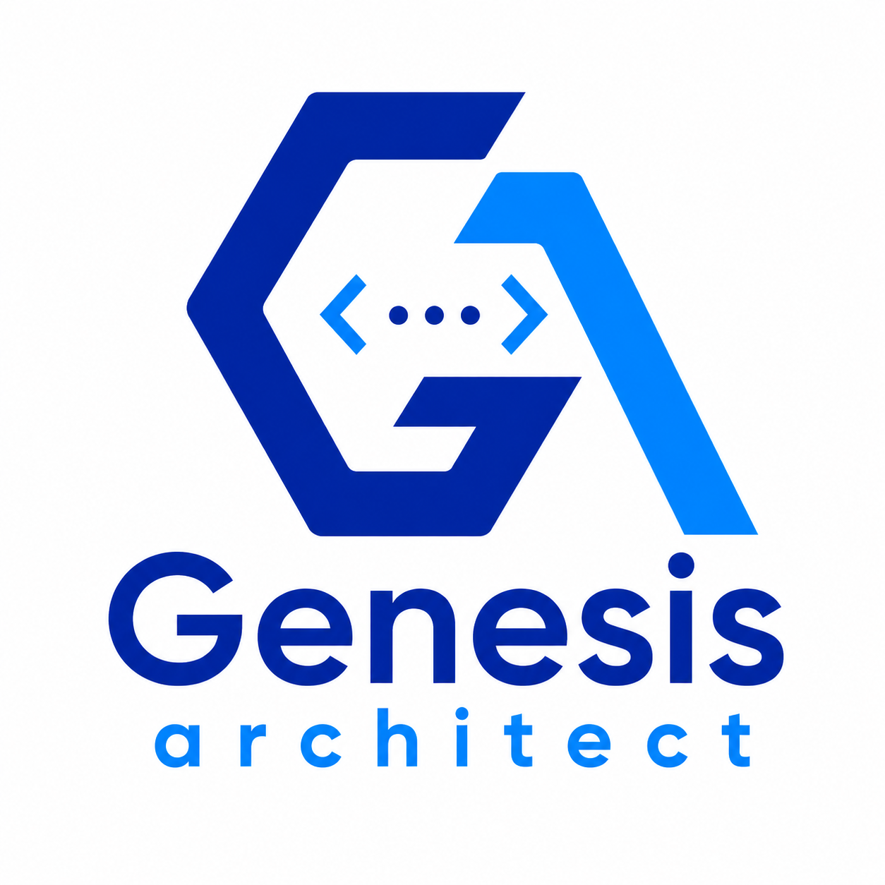

<div align="center">

<picture>
  <source media="(prefers-color-scheme: dark)" srcset="assets/logos/genesis_architect_white_on_black_300dpi.png">
  <source media="(prefers-color-scheme: light)" srcset="assets/logos/genesis_architect_blue_300dpi.png">
  
</picture>

# Genesis Architect

**Most projects fail by repeating mistakes that were already solved in someone else's repository.**

Genesis Architect reads those repositories first. It mines closed issues, active forks and
post-mortems from projects like the one you are about to build, extracts the failures that
keep recurring, and generates a scaffold with those mitigations already in place.

Then it stays. It diagnoses drift, scores architecture, models threats, and tells you which
modules are too fragile to touch.

[](https://github.com/maioio/genesis-architect/actions)
[](https://pypi.org/project/genesis-architect/)
[](https://pypi.org/project/genesis-architect/)
[](LICENSE)
[](tests/)
[](ARCHITECTURE.md)
[](ARCHITECTURE.md)

</div>

---

> [!IMPORTANT]
> **Everything is free now.** Genesis used to be open-core: a free package plus a paid,
> license-gated `genesis-architect-pro`. As of v8.0.0 there is no paid tier. Every engine
> that was behind the paywall (decision engine, knowledge graph, threat modelling, C4
> component diagrams, voice companion, video-to-pitfall) ships in this package under
> AGPL-3.0. No key, no account, no telemetry by default.

---

## Genesis audited itself

The obvious question about a tool that grades architecture is whether it would
survive its own grading. In v9.0.0 it was pointed at its own source, and the
answer was no. It found four import cycles, seven critical anti-patterns, a
1,974-line CLI module importing 31 others, and twenty-one CI actions pinned to
tags that their owners could move at any time.

All of it is now zero.

| | before | after |
|---|---|---|
| Import cycles | 4 | **0** |
| Critical anti-patterns | 7 | **0** |
| Unpinned CI actions | 21 | **0** |
| Largest module fan-out | 31 | **9** |
| Architecture score | 67 | **89** |

> Three of the rules that produced those findings turned out to be wrong, and
> fixing them was part of the release. The hub-file rule counted *test* files as
> coupling, which meant adding tests degraded your score. It could not tell a
> shared type vocabulary from a hub, or a standalone script from a god class.
> Each now discriminates on evidence from the dependency graph.
>
> **Your scores may move on 9.0.0.** That is the correction landing, not a
> regression.

The full method, including how interface parity was proven byte-for-byte across
a nine-module split, is in [ARCHITECTURE.md](ARCHITECTURE.md).

---

## Install

```bash
pip install genesis-architect
```

That is the whole install. Optional extras add voice and the streaming Companion UI:

```bash
pip install "genesis-architect[all]"
```

## Start

```bash
# Research GitHub, then scaffold a project with the mitigations built in
genesis init a Python CLI for analyzing log files

# Point it at code that already exists
genesis recover .        # drift, broken imports, anti-patterns, fragile modules
genesis harden .         # STRIDE threat model, OWASP checklist, secrets scan

# Or just say what you want; it routes to the right engines
genesis decide "why is this project so hard to change?"
```

---

## What it actually produces

Run: `genesis init a Python CLI for analyzing log files`

**Pitfalls found in real GitHub issues, before a single file is written:**

| # | Issue | Found in | Root cause | Built-in mitigation |
|---|-------|----------|-----------|---------------------|
| 1 | [pallets/click#2416](https://github.com/pallets/click/issues/2416) | 4/5 repos | Business logic inside a Click callback, untestable | `cli.py` only parses args, all logic in `core.py` |
| 2 | [pallets/click#2558](https://github.com/pallets/click/issues/2558) | 3/5 repos | Type stubs change in Click 8.1.4 breaks mypy silently | Pin `click>=8.1.7`, `# type: ignore` only where needed |
| 3 | [pallets/click#1846](https://github.com/pallets/click/issues/1846) | 3/5 repos | Raw file path from CLI args allows `../../../etc/passwd` | `get_safe_path(base, user_input)` in `utils/security.py` |
| 4 | [fastapi/typer#522](https://github.com/fastapi/typer/issues/522) | 5/5 repos | No input validation produces cryptic tracebacks | `click.BadParameter` at entry point before processing |

**Scaffold generated, 12 files, no empty stubs:**

```
log-analyzer/
├── src/log_analyzer/
│   ├── main.py        # Click CLI, args only, delegates to core
│   ├── core.py        # All logic here, testable without subprocess
│   └── utils/
│       └── security.py  # get_safe_path(), path traversal guard
├── tests/test_core.py
├── .github/workflows/ci.yml   # tests, secrets, SAST, quality gate
├── pyproject.toml     # click>=8.1.7 pinned, mypy strict, pytest config
├── RESEARCH.md        # 5 repos analyzed, every source verified live
├── PITFALLS.md        # the pitfalls above, with full root cause analysis
└── ROADMAP.md         # scaffold, tests, CI, quality, ship
```

Every cited issue URL is checked by CI. A 404 fails the build.

---

## When not to use it

Genesis is overkill for a throwaway script, a one-off utility, or anything under
100 lines you will delete next week. It earns its keep on projects you intend to
maintain, anything touching auth, file I/O or external APIs, and libraries other
people will depend on.

---

## What is included

Everything below ships in `pip install genesis-architect`.

**Research and scaffolding**
- GitHub repo scan (15 to 20 repos, filtered by stars, recency, language)
- Issue mining, up to 20 closed bug issues per repo across the top 5
- Fork analysis ranked by merged PRs in the last 6 months, not by stars
- Multi-source research orchestration with recency and corroboration scoring
- Evidence packs: every recommendation carries its sources and a confidence grade
- Knowledge vault, local cache with 6-month TTL

**Analysis**
- Import graph for Python, TypeScript/JavaScript, Go, Rust, with cycle detection
- Architecture scoring and anti-pattern detection
- Fragility classification: which modules are stable, fragile, or do-not-touch
- Drift detection against a committed architecture model
- C4 diagrams, all three levels, rendered as Mermaid
- Knowledge graph linking modules, CVEs, risks and decisions into one queryable graph

**Security**
- STRIDE threat model and OWASP Top 10 checklist, tailored per project type
- Offline secrets scanning with redaction
- Dependency CVE lookup via OSV.dev, no API key required

**Working alongside you**
- Decision engine with seven modes, routed from plain language
- Per-project memory and a decision journal as plain Markdown in `.genesis/`
- Companion UI, voice control, and video-to-pitfall extraction (optional extras)

Full command reference: [`genesis --help`](#start), and [SKILL.md](SKILL.md) for the
Claude Code / Cursor integration.

---

## How it works

Before writing a file, Genesis runs real research:

1. **Finds 15 to 20 repositories** solving the problem you described.
2. **Mines their closed issues** for recurring failures, security patches and
   architecture regrets.
3. **Synthesizes what survived** in production across those projects.
4. **Turns each pitfall into a concrete code task**, not a document to read later.

The difference from a template: the scaffold reflects what actually broke for the
people who built this before you.

---

## Under the hood

Four mechanisms do most of the structural work. Each is small, and each exists
because the obvious alternative was measurably wrong.

**Dependency graphs from the AST, not from text.** Imports are read by walking
the parsed tree, so a module named in a docstring or a comment is not an edge.
Imports under `if TYPE_CHECKING:` are pruned too - they never execute, so they
are not dependencies. The `else:` branch and `if not TYPE_CHECKING:` *are*
walked, because that code does run.

**Fan-out ceilings with margin.** A module importing more than 15 others is
flagged; above 30 it is critical. Genesis holds its own modules to 11, and the
widest is 9. A module sitting exactly on a threshold is a latent breach, not a
pass.

**Cycle detection on the hard edges only.** Engines declare `requires`
(a backward edge, topologically sorted, must stay acyclic) separately from
`handoffs` (a forward edge, advisory). Handoff loops are legal on purpose:
`diagnose -> plan -> enforce -> re-diagnose` is a workflow, not a defect.

**Lazy public API (PEP 562).** Importing `genesis_architect.pro` used to pull in
all 43 of its modules. Names now resolve on first attribute access; the API is
identical and fewer than ten submodules load. The eager imports are kept under
`if TYPE_CHECKING:` so type checkers and static analysis still see the whole
surface - which costs nothing at runtime and, since the scanner understands the
guard, nothing in coupling either.

> Every one of those claims is measured in CI, not asserted here. `genesis
> recover .` will tell you the same numbers about your own project.

---

## Use it inside Claude Code, Cursor or Codex

Genesis ships as an agent skill. Clone it where your agent looks for skills:

```bash
# Claude Code
git clone https://github.com/maioio/genesis-architect ~/.claude/skills/genesis-architect

# Codex CLI
git clone https://github.com/maioio/genesis-architect ~/.codex/skills/genesis-architect

# Cursor: copy SKILL.md to .cursor/rules/genesis-architect.md
```

Then describe what you want in plain language. [SKILL.md](SKILL.md) defines the routing.

---

## Configuration

Genesis calls an LLM through [LiteLLM](https://github.com/BerriAI/litellm), so any
provider works: Anthropic, OpenAI, Gemini, or a local Ollama model.

```bash
genesis config set LLM_API_KEY <your-key>
genesis config set GITHUB_TOKEN <token>   # optional, raises the rate limit
```

Local analysis (`recover`, `harden`, import graph, C4, knowledge graph) runs fully
offline and needs no key at all.

Telemetry is **off** by default and opt-in only: `genesis telemetry status`.

---

## Contributing

Issues and pull requests are welcome. Start with [CONTRIBUTING.md](CONTRIBUTING.md);
it covers the dev setup, the test suite, and how to add a scaffold layout or engine.

```bash
git clone https://github.com/maioio/genesis-architect
cd genesis-architect
pip install -e ".[dev]"
pytest -q

# Or run the suite plus end-to-end CLI checks against a real install
docker build -f Dockerfile.test -t genesis-test . && docker run --rm genesis-test
```

Please read the [Code of Conduct](CODE_OF_CONDUCT.md) and
[Security Policy](SECURITY.md) before reporting a vulnerability.

---

## License

[GNU AGPL-3.0-or-later](LICENSE). Copyright (C) 2026 Maio Eshet.

You can use, modify and redistribute Genesis freely, including commercially. The one
obligation: if you modify it and offer it to others over a network, you must publish
your modified source under the same license. Running it on your own code, in your own
company, changes nothing for you.

Releases up to v5.4.1 were published under MIT and remain available under those terms.

---

<div align="center">

If Genesis saved you from a bad architecture decision,
[star it](https://github.com/maioio/genesis-architect/stargazers) so other people find it.

</div>
