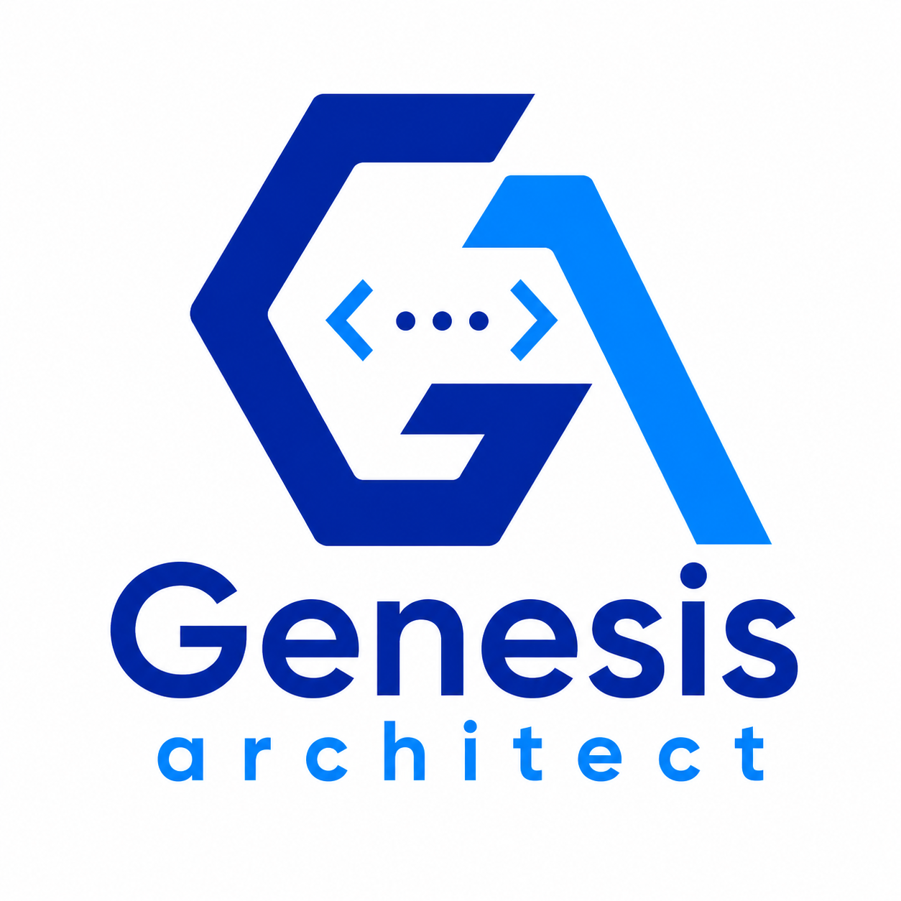

<div align="center">

<picture>
  <source media="(prefers-color-scheme: dark)" srcset="assets/logos/genesis_architect_white_on_black_300dpi.png">
  <source media="(prefers-color-scheme: light)" srcset="assets/logos/genesis_architect_blue_300dpi.png">
  
</picture>

# Genesis Architect

**Most projects fail by repeating mistakes that were already solved in someone else's repository.**

Genesis Architect reads those repositories first. It mines closed issues, active forks and
post-mortems from projects like the one you are about to build, extracts the failures that
keep recurring, and generates a scaffold with those mitigations already in place.

Then it stays. It diagnoses drift, scores architecture, models threats, and tells you which
modules are too fragile to touch.

[](https://github.com/maioio/genesis-architect/actions)
[](https://pypi.org/project/genesis-architect/)
[](https://pypi.org/project/genesis-architect/)
[](LICENSE)
[](tests/)
[](ARCHITECTURE.md)
[](ARCHITECTURE.md)

</div>

---

> [!IMPORTANT]
> **Everything is free now.** Genesis used to be open-core: a free package plus a paid,
> license-gated `genesis-architect-pro`. As of v8.0.0 there is no paid tier. Every engine
> that was behind the paywall (decision engine, knowledge graph, threat modelling, C4
> component diagrams, voice companion, video-to-pitfall) ships in this package under
> AGPL-3.0. No key, no account, no telemetry by default. The former Pro repository's
> source now lives in [`genesis-architect-pro/`](genesis-architect-pro/), and its commit
> history is on this repository's `pro/*` branches.

---

## Genesis audited itself

The obvious question about a tool that grades architecture is whether it would
survive its own grading. In v9.0.0 it was pointed at its own source, and the
answer was no. It found four import cycles, seven critical anti-patterns, a
1,974-line CLI module importing 31 others, and twenty-one CI actions pinned to
tags and branches that their owners could move at any time.

All of it is now zero.

| | before | after |
|---|---|---|
| Import cycles | 4 | **0** |
| Critical anti-patterns | 7 | **0** |
| Unpinned actions in this repo's CI workflows | 21 | **0** |
| CLI fan-out (split into `pro/commands/`) | 31 | **9** |
| Architecture score | 67 | **89** |

> Three of the rules that produced those findings turned out to be wrong, and
> fixing them was part of the release. The hub-file rule counted *test* files as
> coupling, which meant adding tests degraded your score. It could not tell a
> shared type vocabulary from a hub, or a standalone script from a god class.
> Each now discriminates on evidence from the dependency graph.
>
> **Your scores may move on 9.0.0.** That is the correction landing, not a
> regression.

The full method, including how interface parity was proven byte-for-byte across
a nine-module split, is in [ARCHITECTURE.md](ARCHITECTURE.md).

---

## Install

```bash
pip install genesis-architect
```

That is the whole install. The optional extras add the voice companion, the streaming
Companion UI and its desktop window, desktop notifications, a richer terminal UI, and the
committee engine. They pull in heavy native packages, so install them only if you want
those features:

```bash
pip install "genesis-architect[all]"
```

## Start

```bash
# Research GitHub, then scaffold a project with the mitigations built in
genesis init "a Python CLI for analyzing log files"

# Point it at code that already exists
genesis recover .        # drift, broken imports, anti-patterns, fragile modules
genesis harden .         # STRIDE threat model, OWASP checklist, secrets scan

# Or just say what you want; it routes to the right engines
genesis decide "why is this project so hard to change?"
```

---

## What it actually produces

This repository ships a real example: [`examples/python-cli/`](examples/python-cli/), a small
Click CLI that counts the lines, words and characters in a file. Genesis generated it, and
this repository's CI re-checks it on every push to `main` and every pull request.

**The pitfalls it planned for before any code was written:**

| # | Pitfall | Source | Mitigation in the scaffold |
|---|---------|--------|----------------------------|
| 1 | Business logic inside a Click callback can only be tested through the CLI | Standard Click practice | `cli.py` only parses arguments; `core.process_file()` holds the logic |
| 2 | Click 8.1.4 changed its type annotations and broke mypy checks | [pallets/click#2558](https://github.com/pallets/click/issues/2558) | `click>=8.1.7` pinned in `pyproject.toml` |
| 3 | A raw path from the command line allows `../../../etc/passwd` | Standard path-traversal defence | Every file read and write goes through `get_safe_path()` in `utils/security.py` |
| 4 | Errors without input validation reach the user as tracebacks | Standard Click practice | A missing input file is raised as `click.BadParameter`, a usage error |

Only pitfall 2 is tied to an issue that describes it. The issues that the example's
`PITFALLS.md` cites for pitfalls 1, 3 and 4 do not describe those problems, so this table
lists them as standard practice.

**The scaffold, 18 files, no empty stubs:**

```
examples/python-cli/
├── src/python_cli/
│   ├── cli.py         # Click entry point, arguments only, delegates to core
│   ├── core.py        # all logic, plain functions, testable without a subprocess
│   └── utils/
│       └── security.py  # get_safe_path(), the path-traversal guard
├── tests/             # test_core.py, test_security.py
├── docs/adr/001-initial-architecture.md
├── .github/workflows/ci.yml   # tests and lint, Gitleaks secret scan, SonarQube quality gate
├── .genesis/evidence.json     # machine-readable evidence pack
├── pyproject.toml     # click>=8.1.7 pinned, pytest and ruff config
├── RESEARCH.md        # 16 repositories scanned
├── PITFALLS.md        # the pitfalls above, with root cause and mitigation
├── ARCHITECTURE_EVIDENCE.md   # each decision with its sources and confidence
└── ROADMAP.md         # scaffold, tests, CI, quality, ship
```

The example's own evidence pack grades its research `THIN` (confidence 0.64). Genesis
reports how strong its evidence is instead of hiding it.

---

## When not to use it

Genesis is overkill for a throwaway script, a one-off utility, or anything under
100 lines you will delete next week. It earns its keep on projects you intend to
maintain, anything touching auth, file I/O or external APIs, and libraries other
people will depend on.

---

## What is included

Everything below ships in `pip install genesis-architect`.

**Research and scaffolding**
- GitHub repo scan: `genesis init` takes the 15 most-starred matching repos (over 50 stars,
  optionally filtered by language); the agent workflow scans 15 to 20
- Issue mining, up to 20 closed bug issues per repo across the top 5
- Fork analysis ranked by merged PRs in the last 6 months, not by stars (agent workflow)
- Multi-source research orchestration with recency and corroboration scoring
- Evidence packs: every recommendation carries its sources and a confidence grade
- Knowledge vault, local cache with 6-month TTL

**Analysis**
- Import graph for Python, TypeScript/JavaScript, Go, Rust, with cycle detection
- Architecture scoring and anti-pattern detection
- Fragility classification: which modules are stable, fragile, or do-not-touch
- Drift detection against a committed architecture model
- C4 diagrams, all three levels, rendered as Mermaid
- Knowledge graph linking modules, CVEs, risks and decisions into one queryable graph

**Security**
- STRIDE threat model and OWASP Top 10 checklist, tailored per project type
- Offline secrets scanning with redaction
- Dependency CVE lookup via OSV.dev, no API key required

**Working alongside you**
- Decision engine with seven modes, routed from plain language
- Per-project memory and a decision journal as plain Markdown in `.genesis/`
- Companion UI and voice control (optional extras)
- Video-to-pitfall extraction (needs `yt-dlp`, `ffmpeg` and a transcription API key)

Full command reference: [`genesis --help`](#start), and [SKILL.md](SKILL.md) for the
Claude Code, Cursor and Codex integration.

---

## How it works

Before writing a file, Genesis runs real research:

1. **Finds up to 20 repositories** solving the problem you described.
2. **Mines their closed issues** for recurring failures, security patches and
   architecture regrets.
3. **Synthesizes what survived** in production across those projects.
4. **Turns each pitfall into a concrete code task**, not a document to read later.

The difference from a template: the scaffold reflects what actually broke for the
people who built this before you.

---

## Under the hood

Four mechanisms do most of the structural work. Each is small, and each exists
because the obvious alternative was measurably wrong.

**Dependency graphs from the AST, not from text.** Imports are read by walking
the parsed tree, so a module named in a docstring or a comment is not an edge.
Imports under `if TYPE_CHECKING:` are pruned too: they never execute, so they
are not dependencies. The `else:` branch and `if not TYPE_CHECKING:` *are*
walked, because that code does run.

**Fan-out ceilings with margin.** A module importing more than 15 others is
flagged; above 30 it is critical. Genesis holds its own CLI command modules
(`pro/commands/`) to 11, and the widest is 9. A module sitting exactly on a
threshold is a latent breach, not a pass. Outside that boundary one module is
over the line: `gde_engine_adapters.py` imports 21, and Genesis's own scan
reports it as a high-severity god class.

**Cycle detection on the hard edges only.** Engines declare `requires`
(a backward edge, topologically sorted, must stay acyclic) separately from
`handoffs` (a forward edge, advisory). Handoff loops are legal on purpose:
`diagnose -> plan -> enforce -> re-diagnose` is a workflow, not a defect.

**Lazy public API (PEP 562).** Importing `genesis_architect.pro` used to import
42 of its submodules up front. Names now resolve on first attribute access; the
API is identical and fewer than ten submodules load. The eager imports are kept under
`if TYPE_CHECKING:` so type checkers and static analysis still see the whole
surface, which costs nothing at runtime and, since the scanner understands the
guard, nothing in coupling either.

> Every one of those claims is measured in CI, not asserted here. `genesis
> recover .` will tell you the same numbers about your own project.

---

## Use it inside Claude Code, Cursor or Codex

Genesis ships as an agent skill. Clone it where your agent looks for skills:

```bash
# Claude Code
git clone https://github.com/maioio/genesis-architect ~/.claude/skills/genesis-architect

# Codex CLI, and Cursor (which also reads ~/.claude/skills)
git clone https://github.com/maioio/genesis-architect ~/.agents/skills/genesis-architect
```

Then describe what you want in plain language. [SKILL.md](SKILL.md) defines the routing.

---

## Configuration

Genesis calls an LLM through [LiteLLM](https://github.com/BerriAI/litellm), so any
provider works: Anthropic, OpenAI, Gemini, or a local Ollama model.

```bash
genesis config set LLM_API_KEY <your-key>
genesis config set GITHUB_TOKEN <token>   # optional, raises the rate limit
```

Local analysis (`recover`, `harden`, import graph, C4, knowledge graph) needs no key
at all. Everything except the dependency CVE lookup in `harden` runs offline. That
lookup queries OSV.dev for Python dependencies, and without a network it returns no
CVE results instead of failing, so treat an offline run as unchecked, not clean.

Telemetry is **off** by default and opt-in only: `genesis telemetry status`.

---

## Repository layout

```
genesis-architect/
├── src/genesis_architect/
│   ├── core/            31 modules - language-agnostic analysis
│   │   ├── import_graph.py        the dependency graph everything derives from
│   │   ├── antipattern_detector.py god-class, hub-file, circular-dep rules
│   │   └── urls.py                host matching for untrusted URLs
│   └── pro/             63 modules - the decision engine and its engines
│       ├── engine_registry.py     the DAG, cycle detection, topological order
│       ├── engine_bootstrap.py    composition root; the only place engines register
│       ├── gde_gate_engine.py     the 14-gate policy table
│       ├── commands/    10 modules - the CLI, one module per command group
│       ├── engines/      8 modules - individual analysis engines
│       ├── voice/        5 modules - the voice companion
│       ├── streaming/    5 modules - incremental output
│       ├── ide_bridge/   2 modules - localhost bridge for IDE cursor events
│       └── data/         research source registry (JSON)
├── tests/               97 files, 2852 tests
├── scripts/
│   └── architecture_invariants.py regenerates ARCHITECTURE_INVARIANTS.json
├── genesis-architect-pro/       the former Pro repository, with its own pyproject.toml
├── ARCHITECTURE.md              how the analysis works, mechanism by mechanism
├── ARCHITECTURE_INVARIANTS.json every structural number, generated from the code
├── SKILL.md                     the agent-facing instruction file
├── examples/                    generated example projects, validated by CI
└── docs/                        the landing page, ADRs, release notes, demos, and an archive
```

### Where to look

| If you want to | Read |
|---|---|
| Use it | [Start](#start) here, then [SKILL.md](SKILL.md) for agent use |
| Understand a finding it reported | [ARCHITECTURE.md §2](ARCHITECTURE.md): the rules and their discriminators |
| Trust a number in this README | [ARCHITECTURE_INVARIANTS.json](ARCHITECTURE_INVARIANTS.json): generated, not typed |
| Change how imports are counted | `core/import_graph.py`, then [ARCHITECTURE.md §7](ARCHITECTURE.md) |
| Add an engine | `pro/engine_bootstrap.py`, the only registration point |
| Add a CLI command | `pro/commands/`: one module per group, each held to fan-out ≤ 11 |
| Change a gate's severity | `pro/gde_gate_engine.py`, `_GATE_POLICY` |
| Consume this repo as an agent | [ARCHITECTURE_INVARIANTS.json](ARCHITECTURE_INVARIANTS.json) parses; the prose does not |

> Structural numbers above are generated by
> `python scripts/architecture_invariants.py`, and CI fails if the committed
> JSON disagrees with the live package. If this table and that file ever
> conflict, the file is right.

---

## Contributing

Issues and pull requests are welcome. Start with [CONTRIBUTING.md](CONTRIBUTING.md);
it covers the dev setup, the test suite, the codebase layout, and how to add a language
template.

```bash
git clone https://github.com/maioio/genesis-architect
cd genesis-architect
pip install -e ".[dev]"
pytest -q

# Or run the suite plus end-to-end CLI checks against a real install
docker build -f docker/Dockerfile.test -t genesis-test . && docker run --rm genesis-test
```

Please read the [Code of Conduct](CODE_OF_CONDUCT.md) and
[Security Policy](SECURITY.md) before reporting a vulnerability.

---

## License

[GNU AGPL-3.0-or-later](LICENSE). Copyright (C) 2026 Maio Eshet.

You can use, modify and redistribute Genesis freely under the AGPL-3.0, including
commercially. The obligations start when you share it: if you distribute Genesis or a
modified version, or let others use a modified version over a network, you must provide
the source under the same license. Running it on your own code, in your own company,
changes nothing for you.

**Commercial license.** Genesis is dual-licensed. If you want to ship it inside a
closed-source product, or need terms without the AGPL's copyleft, a commercial license
is available. Contact maio.eshet@gmail.com.

Releases up to v5.4.1 were published under MIT and remain available under those terms.

---

<div align="center">

If Genesis saved you from a bad architecture decision,
[star it](https://github.com/maioio/genesis-architect/stargazers) so other people find it.

</div>
